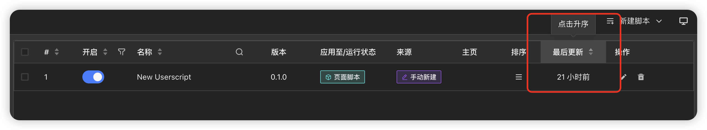
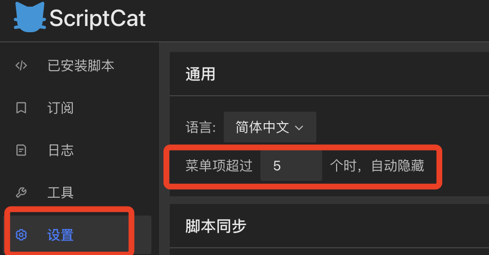
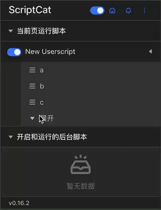
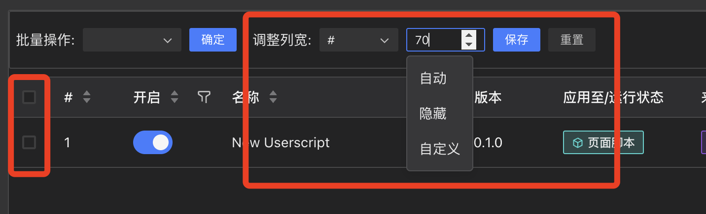

# v0.16

## v0.16.1

## 最后更新添加排序功能

## v0.16.2

## 菜单自动隐藏配置

默认配置为 5 个菜单项，超过 5 个菜单项时，菜单会自动隐藏，点击更多按钮展示隐藏的菜单项。

## 脚本列表添加列调整隐藏操作

## v0.16.3

> 主要为 bug 修复

## v0.16.4

> 主要为 bug 修复

## v0.16.5

> 主要为 bug 修复

