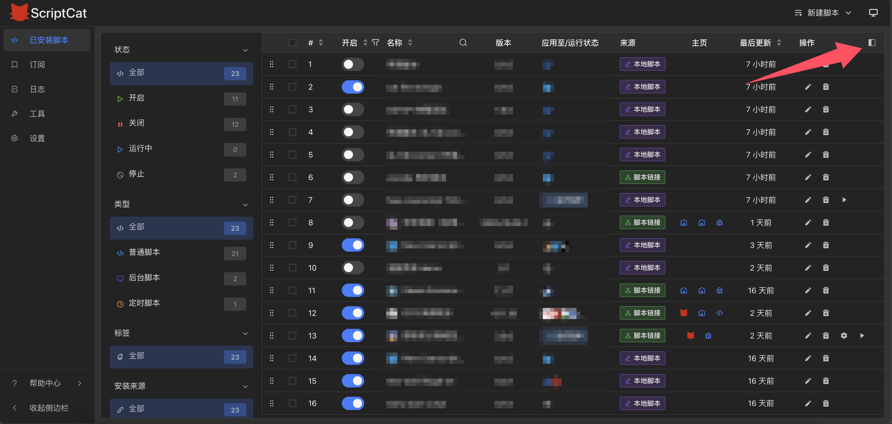
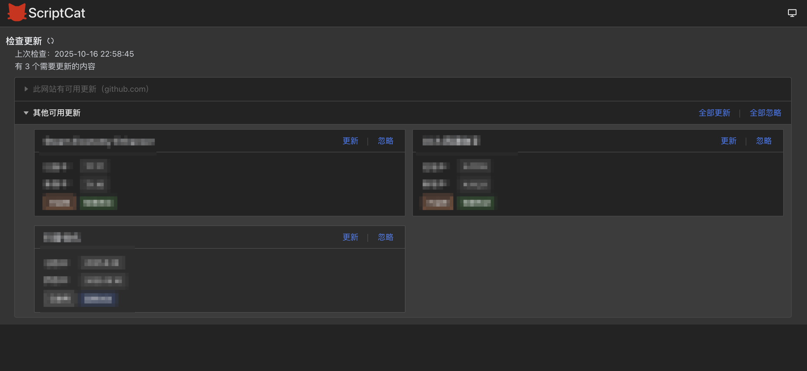
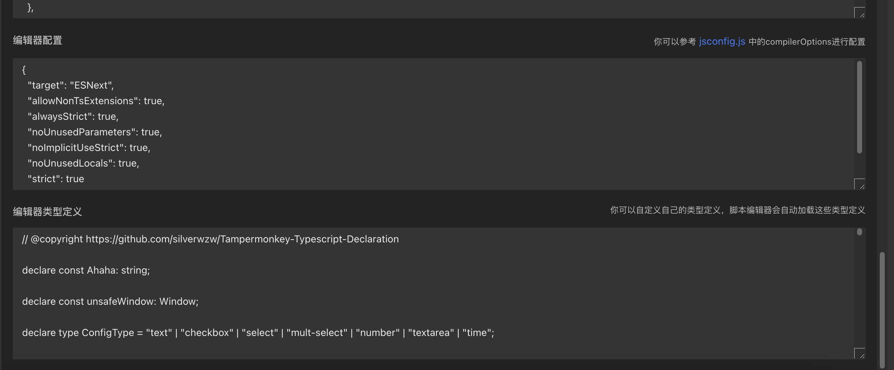

# v1.2

## 脚本列表侧边栏 [#794](https://github.com/scriptscat/scriptcat/issues/794)

增加了侧边栏可以进行高级筛选，增加了标签功能，在脚本->设置中可以对标签进行修改调整

## 更友好的检查更新逻辑 [#755](https://github.com/scriptscat/scriptcat/issues/755)

现在优化了检查更新的逻辑，不会再一股脑的弹出所有脚本的更新提示，而是会合并成一个更新窗口，你可以在这个窗口中选择要更新的脚本，也可以一键更新全部，并且会显示脚本的变动程度

## 增加编辑器配置和编辑器类型定义 [#708](https://github.com/scriptscat/scriptcat/pull/708)

现在可以自定义编辑器配置和编辑器类型定义，编辑器配置可以参考 `tsconfig.json` 中的 [compilerOptions](https://www.typescriptlang.org/tsconfig/#compilerOptions) 进行编写

## API 更新

- 支持 inject into，现在可以将脚本注入到 content 环境中了 [#711](https://github.com/scriptscat/scriptcat/issues/711)
- GM_openInTab 支持置顶窗口、在隐身窗口打开等参数 [#788](https://github.com/scriptscat/scriptcat/pull/788)
- GM_registerMenuCommand 支持二级菜单和分隔线 [#831](https://github.com/scriptscat/scriptcat/pull/831)
