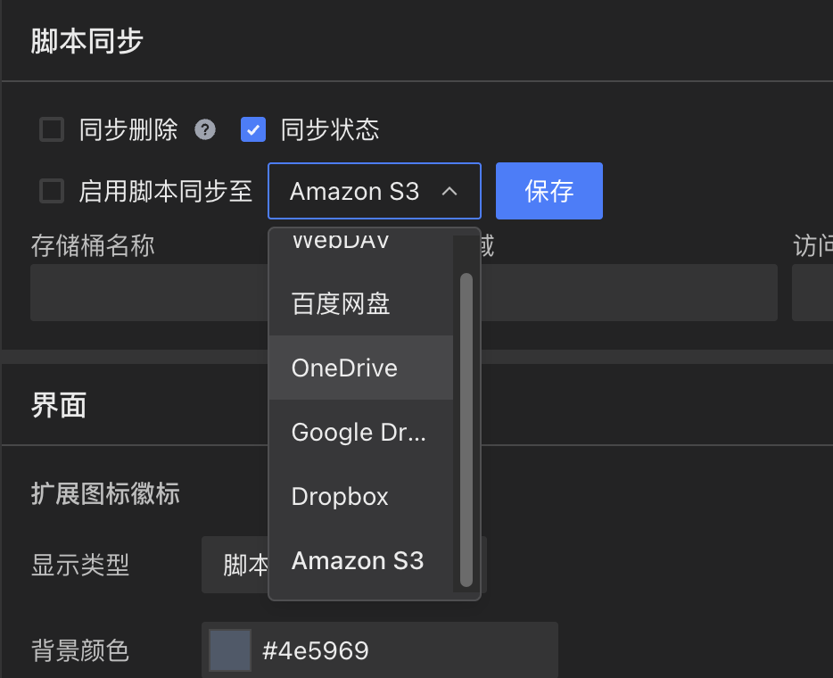

# v1.3

## 新的脚本安装逻辑 [#842](https://github.com/scriptscat/scriptcat/issues/842)

重新设计了脚本安装流程，不再依赖外部网站跳转打开新窗口进行安装，而是直接在当前页面内完成安装。同时优化了安装页面的布局，支持响应式显示，代码预览区域可滚动查看，下载失败等错误也会直接在页面中展示。

## 脚本运行时期选项 [#895](https://github.com/scriptscat/scriptcat/issues/895)

在脚本设置中新增了运行时机选项，可以选择 `document-start`、`document-body`、`document-end`、`document-idle`、`early-start` 等时机，更精确地控制脚本的执行阶段。

## 支持 Amazon S3 存储 [#1146](https://github.com/scriptscat/scriptcat/issues/1146)

云同步和备份功能现在支持 Amazon S3 作为存储后端，除了已有的 WebDAV、坚果云等方式外，提供了更多的存储选择。

## 网盘解除绑定 [#1151](https://github.com/scriptscat/scriptcat/issues/1151)

云同步设置中增加了解除绑定按钮，方便切换或断开云存储连接。
