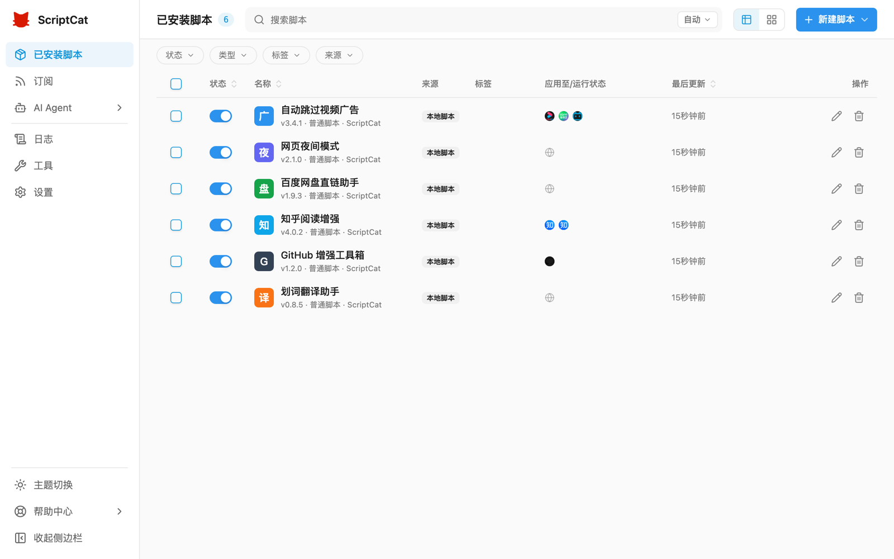
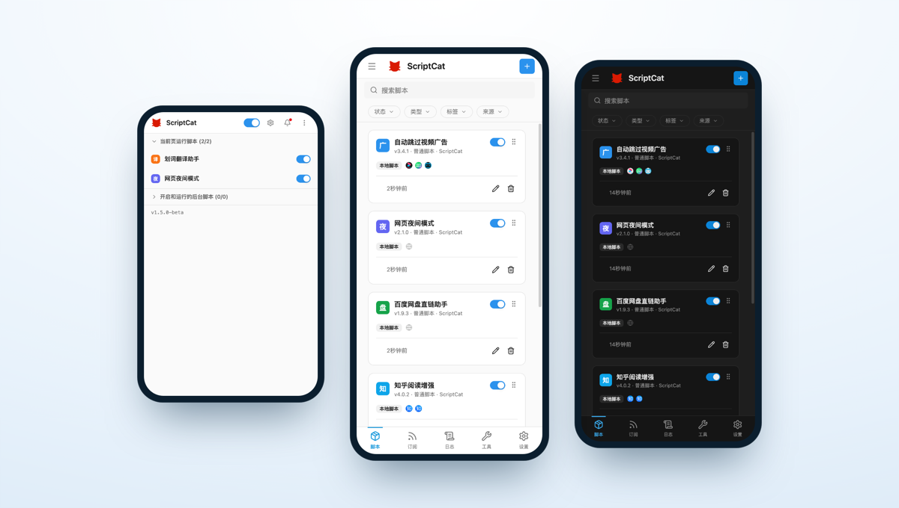

:::caution 测试阶段
v1.5 目前仍处于测试阶段（Beta），以下功能可能会在正式发布前进行调整。欢迎试用并反馈问题，也欢迎前往 [GitHub 讨论区](https://github.com/scriptscat/scriptcat/discussions) 参与新 UI/UX 的讨论。
:::

v1.5 对脚本猫的界面进行了全面重构，界面更清爽、更一致，操作也更顺手；并针对移动端做了专门的设计优化，让桌面与移动端用户都能获得更好的使用体验。

## 全新界面 [#1514](https://github.com/scriptscat/scriptcat/pull/1514)

对整个界面进行了全面重构，视觉风格更统一、层次更清晰，并完整支持明暗双主题。脚本列表提供表格 / 卡片两种视图，配合按状态、类型、标签、来源的高级筛选，管理大量脚本更从容。

## 移动端优化

针对支持扩展的移动浏览器（如 Edge Android、Kiwi 等）专门优化了布局：脚本列表以卡片形式呈现，底部提供导航栏，左侧抽屉可快速进入订阅、日志、工具、设置等板块，扩展 Popup 也适配了窄屏显示。

## 编辑器新建脚本类型选择 [#1544](https://github.com/scriptscat/scriptcat/pull/1544)

编辑器标签栏的「＋」现在支持直接选择要新建的脚本类型（普通脚本 / 后台脚本 / 定时脚本），无需再回到列表页。

## 本地备份手动下载 [#1543](https://github.com/scriptscat/scriptcat/pull/1543)

本地备份新增手动下载链接，可直接将备份文件导出到本地。

## Chromium 148+ 消息序列化 [#1534](https://github.com/scriptscat/scriptcat/pull/1534)

在 Chromium 148+ 上，扩展内部消息启用 `structured_clone` 序列化，支持传递更多数据类型。

## 其它改进

- **GM API**：原生 `GM_download` 现在遵循 `@connect`，与 `GM_xmlhttpRequest` 保持一致 [#1506](https://github.com/scriptscat/scriptcat/pull/1506)
- **性能**：优化脚本加载缓存，并修复 Popup 菜单残留 [#1511](https://github.com/scriptscat/scriptcat/pull/1511)
- **编辑器**：调整 `eslint-plugin-userscripts` 规则 [#1510](https://github.com/scriptscat/scriptcat/pull/1510)
- 预发布（beta）版本更新后会自动打开更新日志页
- **修复**：避免 cron 自动侦测无效时区导致定时任务相关异常 [#1531](https://github.com/scriptscat/scriptcat/pull/1531)
- **修复**：替换 crontab 示例中不可用的演示 API [#1542](https://github.com/scriptscat/scriptcat/pull/1542)
- **国际化**：新增土耳其语
