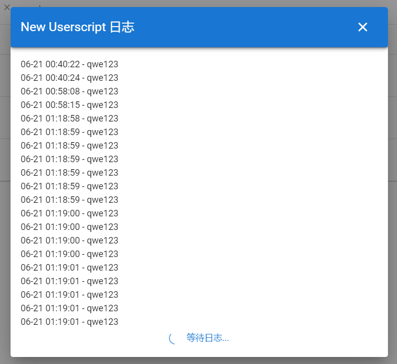
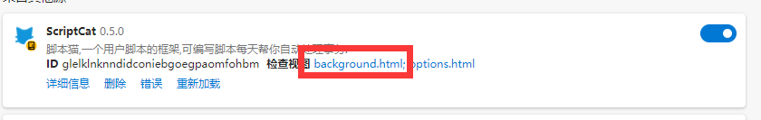

# 后台脚本

后台脚本适用于持续运行类型的脚本.后台脚本是脚本猫特有的脚本,后台脚本运行在沙盒中,无法操作
dom 对象.可使用与油猴一致的 GM API 进行开发,对于兼容性会在文档中标出.

## 后台脚本

后台脚本由`@background`属性声明,后台脚本将允许在开启脚本或者浏览器启动后,让脚本在后台持续运行.

## 定时脚本

> 定时脚本也属于后台脚本的一种,定时脚本适用于每隔一段时间执行一次的脚本.

定时脚本由`@crontab`属性声明,可以精确到秒级调用,提供了一个`once`参数,表示某个时间段内会执行一次(考虑浏览器未打开的情况).建议脚本的运行时间和重试时间不要大于定时时间的间隔.

可使用在线工具测试 cron
表达式,扩展中的`once`替换成`*`:[cron 在线测试](https://tool.lu/crontab/)

在控制台页面,鼠标放置`运行状态`栏时会显示下一次的运行时间.

### Crontab 例子

> 请注意一个脚本中只有第一个 crontab
> 表达式生效,`once`语义为只在当前的时间位上运行一次

```javascript
//@crontab * * * * * * 每秒运行一次
//@crontab * * * * * 每分钟运行一次
//@crontab 0 */6 * * * 每6小时的0分时执行一次
//@crontab 15 */6 * * * 每6小时的15分时执行一次
//@crontab * once * * * 每小时运行一次
//@crontab * * once * * 每天运行一次
//@crontab * 10 once * * 每天10点-10:59中运行一次,假设当10:04时运行了一次,10:05-10:59的后续的时间将不会再运行
//@crontab * 1,3,5 once * * 每天1点3点5点中运行一次,假设当1点时运行了一次,3,5点将不会再运行
//@crontab * */4 once * * 每天每隔4小时检测运行一次,假设当4点时运行了一次,8,12,16,20,24点等后续的时间将不会再运行
//@crontab * 10-23 once * * 每天10点-23:59中运行一次,假设当10:04时运行了一次,10:05-23:59的后续时间将不会再运行
//@crontab * once 13 * * 每个月的13号的每小时运行一次
```

## 日志

在脚本列表页面，鼠标放置`运行状态栏`会提示脚本的运行状态,点击可弹出通过`GM_log`打印的日志内容




## 脚本调试

后台脚本可直接在脚本编辑页面进行调试,但是存在下面问题: value
无法正常同步,registerMenu 菜单无法正常触发.


如果是运行的环境请前往扩展开启**开发人员模式**然后在点击扩展的 background.html
进行调试，运行时产生的错误也可以在运行日志中查看



## Promise

十分推荐这种写法,也便于脚本管理器的脚本监控,对于有异步执行的,必须使用`Promise`.

脚本返回`Promise`对象,管理器也可以将返回的内容当作日志记录下来.

```ts
// ==UserScript==
// @name         后台脚本
// @namespace    wyz
// @version      1.0.0
// @author       wyz
// @background
// ==/UserScript==
return new Promise((resolve, reject) => {
  if (Math.round((Math.random() * 10) % 2)) {
    resolve("ok"); // 执行成功
  } else {
    reject("error"); // 执行失败,并返回错误原因
  }
});
```

```js
// ==UserScript==
// @name         每天运行一次的定时脚本
// @namespace    wyz
// @version      1.0.0
// @author       wyz
// @crontab      * * once * *
// ==/UserScript==
return new Promise((resolve, reject) => {
  if (Math.round((Math.random() * 10) % 2)) {
    resolve("ok"); // 执行成功
  } else {
    reject("error"); // 执行失败,并返回错误原因
  }
});
```

请注意将`resolve/reject`的操作放入执行完毕后的步骤中,`resolve/reject`后管理器会认为脚本执行完毕,后续的所有
GM 操作将不会生效.如果是希望持续运行的后台脚本,可以不调用`resolve`.

```js
// ==UserScript==
// @name         请求API
// @namespace    wyz
// @version      1.0.0
// @author       wyz
// @crontab      * * once * *
// ==/UserScript==
return new Promise((resolve, reject) => {
  GM_xmlhttpRequest({
    url: "https://bbs.tampermonkey.net.cn/",
    onload() {
      resolve("ok"); // 执行成功
    },
    onerror() {
      reject("error"); // 执行失败,并返回错误原因
    },
  });
});
```

## 错误重试

脚本猫后台脚本可以进行重试, 当你的脚本出现错误时, 可以 reject 返回`CATRetryError`,
以便脚本猫重试 重试时间请注意不要与脚本执行时间冲突, 否则可能会导致重复执行,
最小重试时间为 5s

```js
// ==UserScript==
// @name         重试示例
// @namespace    https://bbs.tampermonkey.net.cn/
// @version      0.1.0
// @description  try to take over the world!
// @author       You
// @crontab      * * once * *
// @grant        GM_notification
// ==/UserScript==

return new Promise((resolve, reject) => {
  // Your code here...
  GM_notification({
    title: "retry",
    text: "10秒后重试",
  });
  reject(new CATRetryError("xxx错误", 10));
});
```
