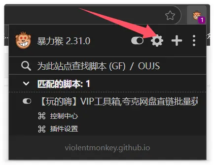
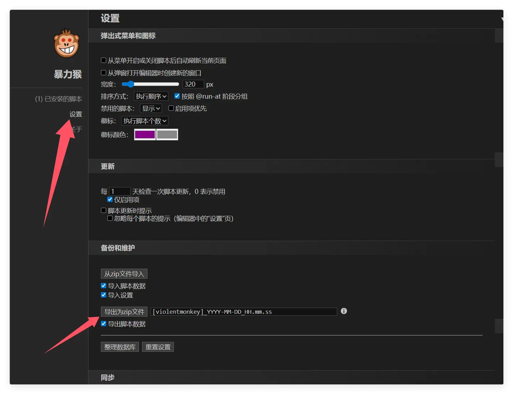
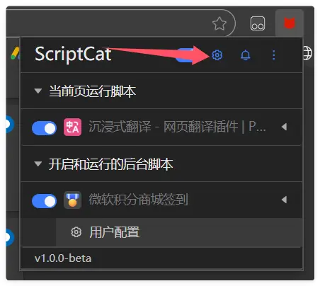
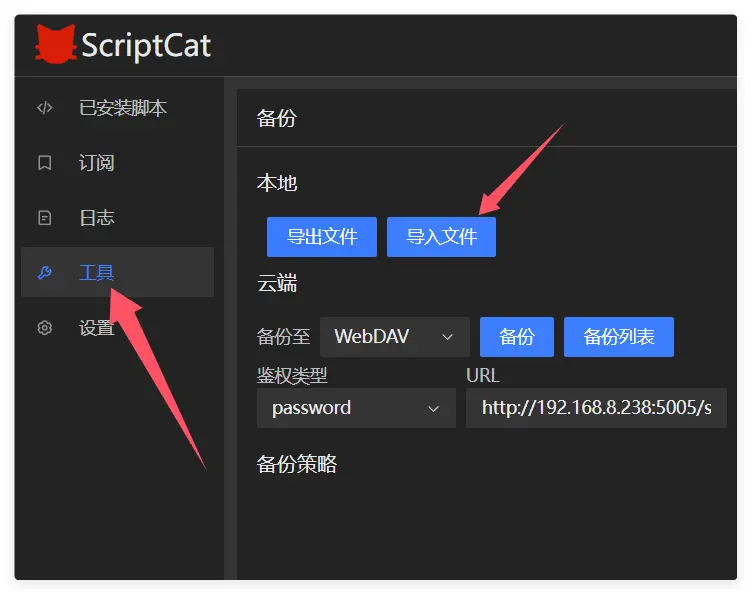

# 从 Violentmonkey 迁移到 Scriptcat

如果你正在使用 Violentmonkey 并希望迁移到 Scriptcat，以下是一些步骤和提示，帮助你顺利完成迁移。

## 从 Violentmonkey 导出备份

首先点击 Violentmonkey 图标，进入管理面板

点击`设置`，点击`导出为zip文件`，即可导出压缩包文件

## 导入到 Scriptcat

在 Scriptcat 扩展中，点击控制面板图标，进入管理面板

选择`工具`，然后点击`导入文件`，选择之前导出的 Tampermonkey 压缩包文件，点击`打开`即可导入。

然后在新弹出的页面中选择或者全选你要导入的脚本，点击`导入`按钮即可。
