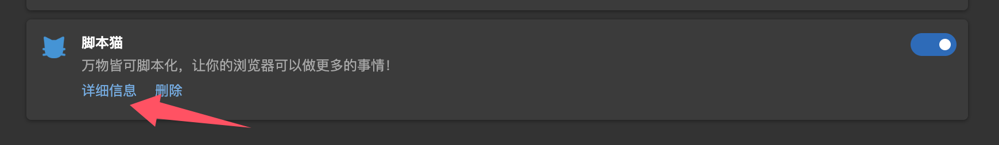
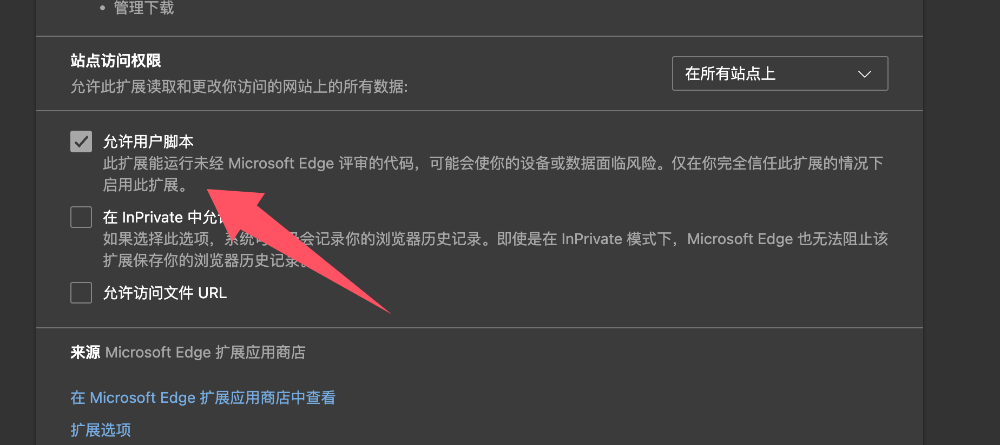
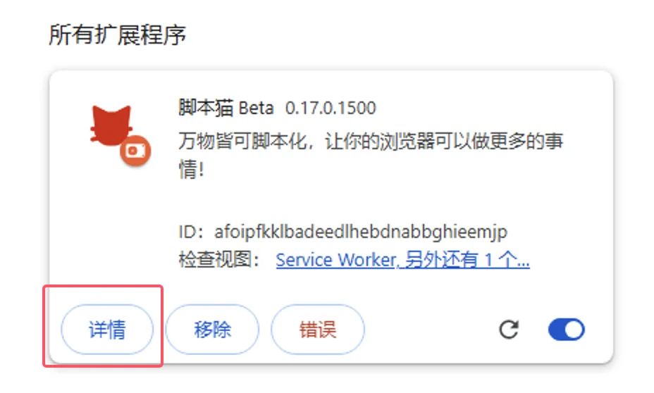
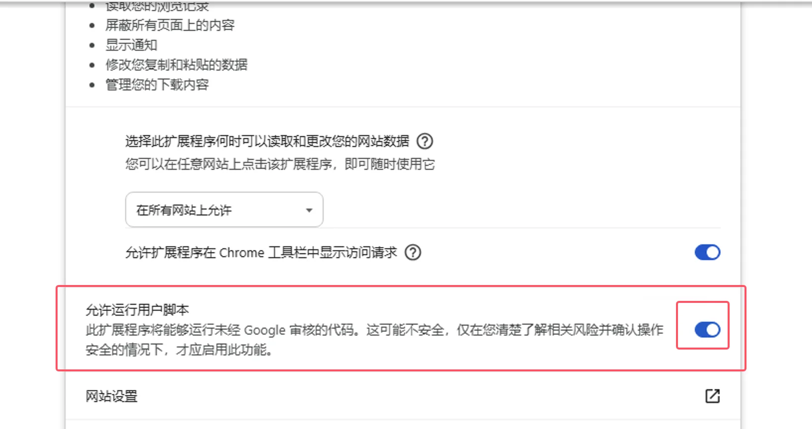

import Tabs from '@theme/Tabs';
import TabItem from '@theme/TabItem';
import { Icon } from "@iconify/react";
import { Space } from "antd";

# 开启浏览器 User Scripts 支持

由于浏览器限制，强制扩展升级 Manifest V3，在 2025 年 6 月后将全面停止 Manifest V2 版本的扩展；

在 Manifest V3 的限制下，必须开启开发者模式/用户脚本功能才能正常使用脚本猫扩展。

参考内容：[面向扩展程序用户的开发者模式](https://developer.chrome.com/docs/extensions/reference/api/userScripts?hl=zh-cn#developer_mode_for_extension_users)、[Manifest V3](https://developer.chrome.com/docs/extensions/develop/migrate/what-is-mv3?hl=zh-cn)

⚠️⚠️⚠️ 在浏览器内核版本>=138 时，需要打开[允许用户脚本](#允许用户脚本)，低版本\<138 则为[开启开发者模式](#开启开发者模式)。

⚠️⚠️⚠️ 请注意，如果你使用的 Windows 8/7/XP 系统，或者浏览器内核版本低于\<120，需要自行手动安装[旧版脚本猫](https://bbs.tampermonkey.net.cn/thread-3068-1-1.html)，v0.16.x 是最后一个支持 Manifest V2 的版本，安装步骤可以参考：[加载解压缩方式安装扩展](/docs/use/use/#%E5%8A%A0%E8%BD%BD%E8%A7%A3%E5%8E%8B%E7%BC%A9%E6%96%B9%E5%BC%8F%E5%AE%89%E8%A3%85%E6%89%A9%E5%B1%95)。

## 允许用户脚本

[允许用户脚本](https://developer.chrome.com/docs/extensions/reference/api/userScripts?hl=zh-cn#chrome_versions_138_and_newer_allow_user_scripts_toggle)是 Manifest V3 的一个新特性，允许用户脚本在浏览器中运行。

<Tabs groupId="browser" queryString>
  <TabItem value="edge" label={
<Icon height={16} width={16} icon="logos:microsoft-edge" />Edge
} default>

① 打开浏览器的扩展管理界面，或者访问 [edge://extensions/](edge://extensions/)

② 在扩展管理界面中，找到脚本猫扩展，点击`详情`

③ 在脚本猫扩展的详情页中，找到`允许用户脚本`选项，开启它，然后关闭扩展再开启扩展，或者重启浏览器，使脚本功能生效。

> ⚠️⚠️⚠️ 低版本 Edge 浏览器(\<=143 版本)或者没有该选项的用户，请参考[开启开发者模式](#开启开发者模式)

  </TabItem>
  <TabItem value="chrome" label={
<Icon height={16} width={16} icon="logos:chrome" />Chrome
}>

① 打开浏览器的扩展管理界面，或者访问 [chrome://extensions/](chrome://extensions/)

② 在扩展管理界面中，找到脚本猫扩展，点击`详情`

③ 在脚本猫扩展的详情页中，找到`允许用户脚本`选项，开启它，然后关闭扩展再开启扩展，或者重启浏览器，使脚本功能生效。

</TabItem>
</Tabs>

## 开启开发者模式

<Tabs groupId="browser" queryString>
  <TabItem value="edge" label={
<Icon height={16} width={16} icon="logos:microsoft-edge" />Edge
} default>

① 打开浏览器的扩展管理界面，或者访问 [edge://extensions/](edge://extensions/)

② 打开`开发人员模式`（某些浏览器该模式可能会存在其他选项中 如 360 浏览器: 高级管理>开发者模式）

③ 开启开发者模式后，关闭扩展再开启扩展，或者重启浏览器，使脚本功能生效。

  </TabItem>
  <TabItem value="chrome" label={
<Icon height={16} width={16} icon="logos:chrome" />Chrome
}>

① 打开浏览器的扩展管理界面，或者访问 [chrome://extensions/](chrome://extensions/)

② 打开`开发人员模式`（某些浏览器该模式可能会存在其他选项中 如 360 浏览器: 高级管理>开发者模式）

③ 开启开发者模式后，关闭扩展再开启扩展，或者重启浏览器，使脚本功能生效。

  </TabItem>

<TabItem value="edge-mobile" label={
<Icon height={16} width={16} icon="logos:microsoft-edge" />Edge Mobile
}>

Edge手机版本点击扩展页上方的设置按钮即可开启

</TabItem>

</Tabs>
