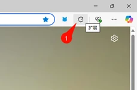
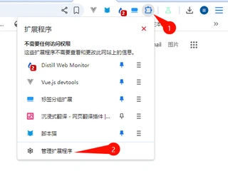
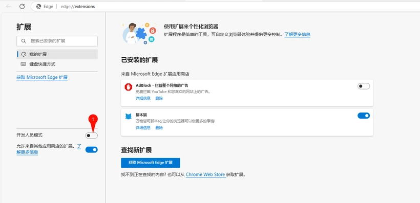
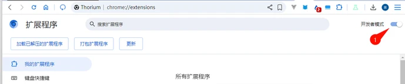

# 开启开发者模式支持 manifest v3 版脚本猫

> 由于浏览器限制，强制扩展升级 Manifest V3，在 2025 年 6 月后将全面停止 Manifest V2 版本的扩展；
>
> 在 Manifest V3 的限制下，必须开启开发者模式才能正常使用用户脚本功能。
>
> 参考内容：[面向扩展程序用户的开发者模式](https://developer.chrome.com/docs/extensions/reference/api/userScripts?hl=zh-cn#developer_mode_for_extension_users)、[Manifest V3](https://developer.chrome.com/docs/extensions/develop/migrate/what-is-mv3?hl=zh-cn)

## 如何开启开发者模式

① 打开浏览器的扩展管理界面，或者访问[edge://extensions/](edge://extensions/)

- 1. **Edge**

  

- 2. **Chrome**

  

② 打开`开发人员模式`（某些浏览器该模式可能会存在其他选项中 如 360 浏览器: 高级管理>开发者模式）

- 1. **Edge** 
- 2. **Chrome** 

③ 开启开发者模式后，点击重新加载重启一次扩展，或者重启浏览器，使脚本功能生效。
