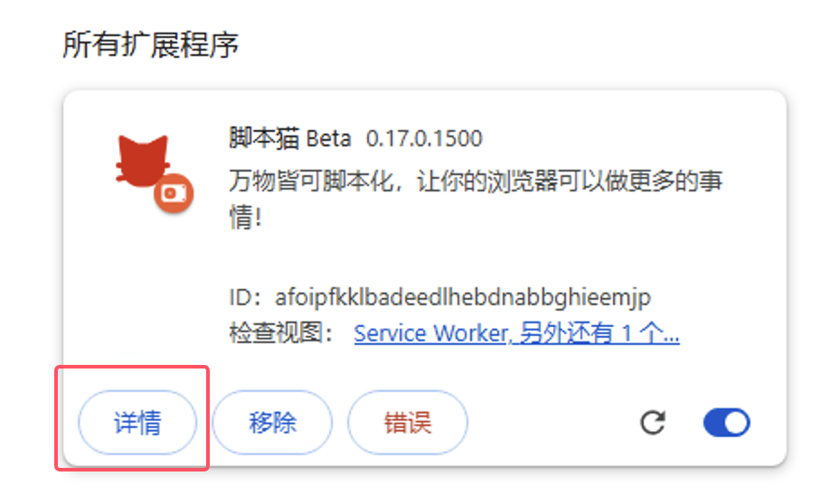

# 开启浏览器 User Scripts 支持

> 由于浏览器限制，强制扩展升级 Manifest V3，在 2025 年 6 月后将全面停止 Manifest V2 版本的扩展；
>
> 在 Manifest V3 的限制下，必须开启开发者模式/用户脚本功能才能正常使用脚本猫扩展。
>
> 参考内容：[面向扩展程序用户的开发者模式](https://developer.chrome.com/docs/extensions/reference/api/userScripts?hl=zh-cn#developer_mode_for_extension_users)、[Manifest V3](https://developer.chrome.com/docs/extensions/develop/migrate/what-is-mv3?hl=zh-cn)

在浏览器内核版本>=138 时，需要打开[允许用户脚本](#允许用户脚本)，低版本\<138 则为[开启开发者模式](#开启开发者模式)。

## 允许用户脚本

[允许用户脚本](https://developer.chrome.com/docs/extensions/reference/api/userScripts?hl=zh-cn#chrome_versions_138_and_newer_allow_user_scripts_toggle)是 Manifest V3 的一个新特性，允许用户脚本在浏览器中运行。

① 打开浏览器的扩展管理界面，或者访问[edge://extensions/](edge://extensions/)、[chrome://extensions/](chrome://extensions/)

- 1. **Edge**

  

- 2. **Chrome**

  

② 在扩展管理界面中，找到脚本猫扩展，点击`详情`

③ 在脚本猫扩展的详情页中，找到`允许用户脚本`选项，开启它，然后点击`重新加载`按钮重启扩展，或者重启浏览器，使脚本功能生效。

> 如果使用Edge浏览器(>=138版本)没有发现`允许用户脚本`选项，请参考此项：[Edge浏览器未显示允许用户脚本选项](https://github.com/scriptscat/scriptcat/issues/418#issuecomment-2994772406)

## 开启开发者模式

① 打开浏览器的扩展管理界面，或者访问[edge://extensions/](edge://extensions/)、[chrome://extensions/](chrome://extensions/)

- 1. **Edge**

  

- 2. **Chrome**

  

② 打开`开发人员模式`（某些浏览器该模式可能会存在其他选项中 如 360 浏览器: 高级管理>开发者模式）

- 1. **Edge** 
- 2. **Chrome** 

③ 开启开发者模式后，点击`重新加载`重启一次扩展，或者重启浏览器，使脚本功能生效。
