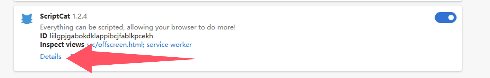

import Tabs from '@theme/Tabs';
import TabItem from '@theme/TabItem';
import { Icon } from "@site/src/components/Icon";
import BrowserGuide from '@site/src/components/BrowserGuide';
import GithubStar from '@site/src/components/GithubStar';

<GithubStar variant="bar" scene="install" />

<BrowserGuide texts={{
  allowUserScripts: {
    title: "متصفحك يدعم «Allow User Scripts»",
    description: "اتبع الخطوات أدناه لتفعيل خيار «Allow User Scripts» لاستخدام ScriptCat بشكل طبيعي.",
    button: "عرض الخطوات",
    anchor: "#allow-user-scripts",
  },
  devMode: {
    title: "يجب تفعيل «وضع المطور» في متصفحك",
    description: "اتبع الخطوات أدناه لتفعيل «وضع المطور» لاستخدام ScriptCat بشكل طبيعي.",
    button: "عرض الخطوات",
    anchor: "#enable-developer-mode",
  },
  legacy: {
    title: "إصدار متصفحك قديم جداً",
    description: "متصفحك لا يدعم Manifest V3. يجب عليك تثبيت الإصدار القديم من ScriptCat (v0.16.x) يدوياً. انظر التعليمات أدناه.",
  },
  nonChromium: {
    title: "لم يتم اكتشاف متصفح قائم على Chromium",
    description: "يدعم ScriptCat حالياً المتصفحات القائمة على Chromium فقط (مثل Chrome وEdge وغيرها). إذا كنت تستخدم متصفحاً قائماً على Chromium، فتجاهل هذه الرسالة واتبع الخطوات أدناه.",
  },
}} />

## تفعيل «User Scripts» {#allow-user-scripts}

[Allow User Scripts](https://developer.chrome.com/docs/extensions/reference/api/userScripts?hl=en#chrome_versions_138_and_newer_allow_user_scripts_toggle) هي ميزة جديدة في Manifest V3 تسمح لسكرپتات المستخدم بالعمل في المتصفح.

<Tabs groupId="browser" queryString>
  <TabItem value="edge" label={
<Icon height={16} width={16} icon="logos:microsoft-edge" />Edge
} default>

① افتح واجهة إدارة الإضافات في المتصفح، أو انتقل إلى [edge://extensions/](edge://extensions/)

② في واجهة إدارة الإضافات، ابحث عن إضافة ScriptCat وانقر على `التفاصيل`

③ في صفحة تفاصيل إضافة ScriptCat، ابحث عن خيار `Allow user scripts` وقم بتفعيله. ثم عطّل الإضافة وأعد تفعيلها، أو أعد تشغيل المتصفح حتى تعمل السكرپتات.

> ⚠️⚠️⚠️ بالنسبة للإصدارات الأقدم من Edge (\<=143) أو المستخدمين الذين لا يملكون هذا الخيار، يرجى الرجوع إلى [تفعيل وضع المطور](#enable-developer-mode)

  </TabItem>
  <TabItem value="chrome" label={
<Icon height={16} width={16} icon="logos:chrome" />Chrome
}>

① افتح واجهة إدارة الإضافات في المتصفح، أو انتقل إلى [chrome://extensions/](chrome://extensions/)

② في واجهة إدارة الإضافات، ابحث عن إضافة ScriptCat وانقر على `التفاصيل`

③ في صفحة تفاصيل إضافة ScriptCat، ابحث عن خيار `Allow user scripts` وقم بتفعيله. ثم عطّل الإضافة وأعد تفعيلها، أو أعد تشغيل المتصفح حتى تعمل السكرپتات.

</TabItem>
  <TabItem value="edge-mobile" label={
<Icon height={16} width={16} icon="logos:microsoft-edge" />Edge Mobile
}>

بالنسبة إلى Edge Mobile بإصدار محرك متصفح ≥ 138، فإن وضع المطور غير مطلوب. فعّل `Allow user scripts` من إعدادات الإضافة بدلاً من ذلك.

① افتح قائمة إضافات Edge Mobile، وابحث عن إضافة ScriptCat، واضغط على زر `⋮` على اليمين

② في نافذة إعدادات الإضافة، فعّل `Allow user scripts`

③ عطّل الإضافة وأعد تفعيلها، أو أعد تشغيل المتصفح حتى تعمل السكرپتات.

> ⚠️⚠️⚠️ بالنسبة لإصدارات محرك المتصفح الأقل من 138، أو المستخدمين الذين لا يملكون هذا الخيار، يرجى الرجوع إلى [تفعيل وضع المطور](#enable-developer-mode)

  </TabItem>
</Tabs>

## تفعيل وضع المطور {#enable-developer-mode}

<Tabs groupId="browser" queryString>
  <TabItem value="edge" label={
<Icon height={16} width={16} icon="logos:microsoft-edge" />Edge
} default>

① افتح واجهة إدارة الإضافات في المتصفح، أو انتقل إلى [edge://extensions/](edge://extensions/)

② فعّل `وضع المطور` (في بعض المتصفحات، قد يكون هذا الوضع في خيارات أخرى، مثل متصفح 360: الإدارة المتقدمة > وضع المطور)

③ بعد تفعيل وضع المطور، عطّل الإضافة ثم أعد تفعيلها، أو أعد تشغيل المتصفح حتى تعمل السكرپتات.

  </TabItem>
  <TabItem value="chrome" label={
<Icon height={16} width={16} icon="logos:chrome" />Chrome
}>

① افتح واجهة إدارة الإضافات في المتصفح، أو انتقل إلى [chrome://extensions/](chrome://extensions/)

② فعّل `وضع المطور` (في بعض المتصفحات، قد يكون هذا الوضع في خيارات أخرى، مثل متصفح 360: الإدارة المتقدمة > وضع المطور)

③ بعد تفعيل وضع المطور، عطّل الإضافة ثم أعد تفعيلها، أو أعد تشغيل المتصفح حتى تعمل السكرپتات.

  </TabItem>

<TabItem value="edge-mobile" label={
<Icon height={16} width={16} icon="logos:microsoft-edge" />Edge Mobile
}>

بالنسبة إلى Edge Mobile بإصدار محرك متصفح أقل من 138، أو بدون خيار `Allow user scripts`، اضغط على زر الإعدادات أعلى صفحة الإضافات لتفعيل وضع المطور.

</TabItem>

</Tabs>

:::warning تنبيه الإصدار القديم

إذا كنت تستخدم أنظمة Windows 8/7/XP، أو كان إصدار محرك متصفحك أقل من 120، فيجب عليك تثبيت [الإصدار القديم من ScriptCat](https://bbs.tampermonkey.net.cn/thread-3068-1-1.html) يدوياً. v0.16.x هو آخر إصدار يدعم Manifest V2. يمكن العثور على خطوات التثبيت هنا: [تثبيت الإضافة غير المعبأة](/docs/use/use/#load-unpacked-extension-installation).

:::

خلفية تقنية: Manifest V3

بسبب قيود المتصفحات، تُجبر الإضافات على الترقية إلى Manifest V3، وستتوقف إضافات Manifest V2 تماماً بعد يونيو 2025. في ظل قيود Manifest V3، يجب عليك تفعيل وضع المطور أو ميزة سكرپتات المستخدم لاستخدام إضافة ScriptCat بشكل طبيعي.

المراجع: [وضع المطور لمستخدمي الإضافات](https://developer.chrome.com/docs/extensions/reference/api/userScripts?hl=en#developer_mode_for_extension_users)، [Manifest V3](https://developer.chrome.com/docs/extensions/develop/migrate/what-is-mv3?hl=en)

بالنسبة لإصدارات محرك المتصفح ≥ 138، يجب عليك تفعيل «Allow User Scripts». أما بالنسبة للإصدارات الأقل، فاستخدم «تفعيل وضع المطور».

