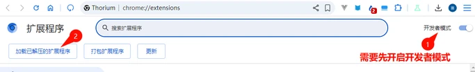

ScriptCat একটি ব্রাউজার এক্সটেনশন যা ইউজার স্ক্রিপ্ট চালাতে পারে, Tampermonkey স্ক্রিপ্টগুলির সাথে সামঞ্জস্যপূর্ণ এবং আরও ফিচার প্রদান করে। কোনো বাগ পেলে বা পরামর্শ থাকলে, আপনি প্রতিক্রিয়া জানাতে [GitHub রিপো](https://github.com/scriptscat/scriptcat) দেখতে পারেন।

## এক্সটেনশন ইনস্টল করুন

আপনি নিম্নলিখিত এক্সটেনশন স্টোরগুলি থেকে এক্সটেনশনটি ইনস্টল করতে পারেন:

| ব্রাউজার         | স্টোর লিংক                                                                                                                                                                                                                                     | অবস্থা         |
| --------------- | ---------------------------------------------------------------------------------------------------------------------------------------------------------------------------------------------------------------------------------------------- | -------------- |
| Chrome          | [স্টেবল সংস্করণ](https://chrome.google.com/webstore/detail/scriptcat/ndcooeababalnlpkfedmmbbbgkljhpjf) [বিটা সংস্করণ](https://chromewebstore.google.com/detail/%E8%84%9A%E6%9C%AC%E7%8C%AB-beta/jaehimmlecjmebpekkipmpmbpfhdacom?authuser=0&hl=zh-CN) | ✅ উপলব্ধ    |
| Edge            | [স্টেবল সংস্করণ](https://microsoftedge.microsoft.com/addons/detail/scriptcat/liilgpjgabokdklappibcjfablkpcekh) [বিটা সংস্করণ](https://microsoftedge.microsoft.com/addons/detail/scriptcat-beta/nimmbghgpcjmeniofmpdfkofcedcjpfi)                      | ✅ উপলব্ধ    |
| Firefox         | [স্টেবল সংস্করণ](https://addons.mozilla.org/zh-CN/firefox/addon/scriptcat/) [বিটা সংস্করণ](https://addons.mozilla.org/zh-CN/firefox/addon/scriptcat-pre/)                                                                                             | ✅ MV2         |

### অন্যান্য ব্রাউজার

যদি আপনার ব্রাউজার উপরের তালিকায় না থাকে, আপনি [Github Release](https://github.com/scriptscat/scriptcat/releases) পৃষ্ঠা থেকে `zip`/`crx` ফাইল ডাউনলোড করে ম্যানুয়ালি ইনস্টল করতে পারেন।

### আনপ্যাকড এক্সটেনশন ইনস্টলেশন {#load-unpacked-extension-installation}

① প্রথমে [Github Release](https://github.com/scriptscat/scriptcat/releases) বা [কমিউনিটি ডাউনলোড](https://bbs.tampermonkey.net.cn/thread-3068-1-1.html) পৃষ্ঠা থেকে `zip` ফাইলটি ডাউনলোড করুন। যদি এটি `crx` ফাইল হয়, এর এক্সটেনশনটি `zip`-এ পরিবর্তন করুন।

② প্লাগইন সংরক্ষণের জন্য একটি ফোল্ডার প্রস্তুত করুন এবং উপরের zip ফাইলটি সেই ফোল্ডারে এক্সট্র্যাক্ট করুন। এক্সট্র্যাক্টের পরে এটি এভাবে দেখতে হবে (**লক্ষ্য করুন: এই ফোল্ডারটি মুছে ফেলা বা সরানো যাবে না, অন্যথায় এক্সটেনশনটি সঠিকভাবে কাজ করবে না**) 

③ আনপ্যাকড এক্সটেনশন লোড করতে ব্রাউজারের এক্সটেনশন ম্যানেজমেন্ট ইন্টারফেস খুলুন (ডেভেলপার মোড সক্রিয় করতে [manifest v3 ScriptCat সমর্থন করতে ডেভেলপার মোড সক্রিয় করুন](/docs/use/open-dev/) দেখুন)

- 1. **Edge** 
- 2. **Chrome** 

④ ধাপ ②-তে তৈরি ফোল্ডারটি নির্বাচন করুন (লোড সম্পূর্ণ হওয়ার পরে, ScriptCat আইকনটি এক্সটেনশন ম্যানেজমেন্ট ইন্টারফেসের এক্সটেনশন তালিকায় দেখা যাবে এবং ব্রাউজারের অ্যাড্রেস বারের উপরের ডান কোণার এক্সটেনশন বাটনে ক্লিক করেও দেখতে পারেন)

- 1. **Edge** 
- 2. **Chrome** 

⑤ উপরের ডান কোণার ScriptCat আইকনে ক্লিক করুন, উপস্থিত ইন্টারফেসের উপরের ডান কোণায় `┆` > স্ক্রিপ্ট পান-এ ক্লিক করুন এবং স্ক্রিপ্ট সাইটে গিয়ে স্ক্রিপ্ট অনুসন্ধান ও ইনস্টল করতে পারেন।

লক্ষ্য করুন: এভাবে ইনস্টল করা এক্সটেনশনগুলি স্বয়ংক্রিয়ভাবে আপডেট হতে পারে না। আপডেটের প্রয়োজন হলে, এক্সটেনশনটি আপডেট করতে উপরের ধাপগুলি পুনরাবৃত্তি করুন (ফাইল প্রতিস্থাপন করে একবার পুনরায় লোড করুন)।

## স্ক্রিপ্ট পান

> স্ক্রিপ্ট ছাড়াও, [Tampermonkey চাইনিজ ফোরাম](https://bbs.tampermonkey.net.cn/) এবং [স্ক্রিপ্ট ডেভেলপমেন্ট গাইড](https://learn.scriptcat.org/) থেকে কিছু স্ক্রিপ্ট তথ্য ও টিউটোরিয়ালও পেতে পারেন।

### ScriptCat স্ক্রিপ্ট সাইট

[ScriptCat স্ক্রিপ্ট সাইট](https://scriptcat.org/) এই এক্সটেনশনের স্ক্রিপ্ট সাইট, যেখানে আপনি লেখা স্ক্রিপ্ট প্রকাশ করতে পারেন।

- নতুন স্ক্রিপ্ট সাইট
- ব্যাকগ্রাউন্ড স্ক্রিপ্ট / নির্ধারিত স্ক্রিপ্ট
- ব্যবহারকারী-বান্ধব ইন্টারফেস

### Userscript.Zone অনুসন্ধান

[Userscript.Zone অনুসন্ধান](https://www.userscript.zone/?utm_source=tm.net&utm_medium=scripts) একটি নতুন ওয়েবসাইট যা উপযুক্ত URL বা ডোমেইন প্রবেশ করিয়ে ইউজার স্ক্রিপ্ট অনুসন্ধানের অনুমতি দেয়।

- প্রচুর স্ক্রিপ্ট সম্পদ
- উপযুক্ত ইউজার স্ক্রিপ্ট খুঁজে পাওয়া সহজ
- শুধুমাত্র পর্যালোচিত ইউজার স্ক্রিপ্ট পৃষ্ঠা বা অন্তত মন্তব্য কার্যকারিতা সহ পৃষ্ঠাগুলির ইউজার স্ক্রিপ্ট দেখায়

### GreasyFork

[GreasyFork](https://greasyfork.org/) ইউজারস্ক্রিপ্ট হোস্টিং ও শেয়ার করার জন্য ব্যাপকভাবে ব্যবহৃত একটি প্ল্যাটফর্ম, যা ডেভেলপারদের প্রকাশ করতে এবং ব্যবহারকারীদের ওয়েবসাইট কার্যকারিতা উন্নত বা পরিবর্তন করে এমন ব্রাউজার-ভিত্তিক স্ক্রিপ্ট ইনস্টল করতে দেয়। সাইটটি Jason Barnabe তৈরি করেছেন এবং নিরাপত্তা ও ওপেন-সোর্স স্বচ্ছতার উপর জোর দেওয়ার জন্য পরিচিত, ব্রাউজিং অভিজ্ঞতা উন্নত করার জন্য স্ক্রিপ্টের একটি বড় সংগ্রহ অফার করে।

Jason Barnabe Stylish ব্রাউজার এক্সটেনশনেরও মূল নির্মাতা। তবে [Stylish](https://userstyles.org/) ২০১৬ সালে বিক্রি হয়েছিল এবং এখন একটি ভিন্ন কোম্পানি পরিচালনা করে, যার পরবর্তী উন্নয়নে Jason Barnabe-এর কোনো সরাসরি সম্পৃক্ততা নেই।

- প্রচুর স্ক্রিপ্ট সম্পদ
- Github থেকে স্ক্রিপ্ট সিঙ্ক করার ক্ষমতা আছে
- খুব সক্রিয় [ওপেন সোর্স উন্নয়ন মডেল](https://github.com/JasonBarnabe/greasyfork)

### GitHub/Gist

আপনি [Github এবং Gist-এ স্ক্রিপ্ট সম্পদ অনুসন্ধান করতে পারেন।](https://gist.github.com/search?l=JavaScript&o=desc&q="%3D%3DUserScript%3D%3D"&s=updated)

## অনবোর্ডিং ট্যুর

ScriptCat ইনস্টল করার পরে, ড্যাশবোর্ড খুললে স্বয়ংক্রিয়ভাবে অনবোর্ডিং ট্যুর শুরু হবে (বাম সাইডবারের "হেল্প সেন্টার" থেকে যেকোনো সময় এটি পুনরায় খুলতে পারেন)। ট্যুরটি নিম্নলিখিত বিষয়গুলি কভার করে:

- [স্ক্রিপ্ট ইনস্টল করুন](/docs/use/script_installation/): স্ক্রিপ্ট মার্কেটপ্লেস থেকে ইনস্টল করুন, যার মধ্যে [ব্যাকগ্রাউন্ড স্ক্রিপ্ট](/docs/dev/background/) সমর্থন অন্তর্ভুক্ত।
- ব্যবস্থাপনা ও পরিচালনা: সম্পাদনা, চালানো/বন্ধ করা, [UserConfig](/docs/dev/config/)।
- [ব্যাকআপ](/docs/use/sync/) এবং [অন্যান্য ম্যানেজার থেকে মাইগ্রেট](/docs/use/from-other/migrate-from-tampermonkey/)।
- [স্ক্রিপ্ট সিঙ্ক](/docs/use/sync/)।
- [সাবস্ক্রিপশন](/docs/dev/subscribe/)।
