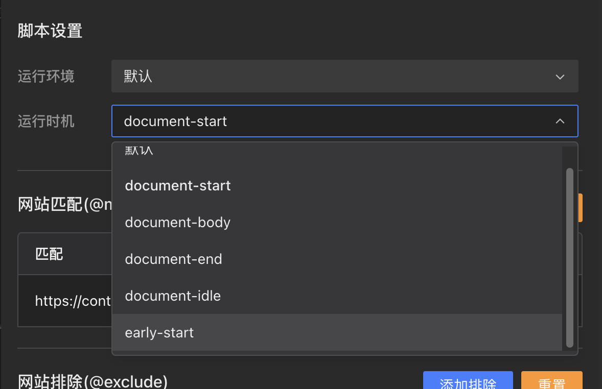
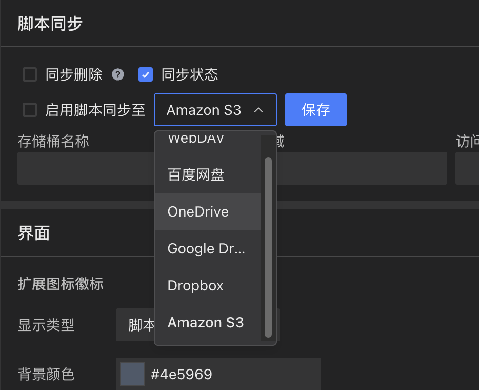

## Neuer Skriptinstallationsablauf [#842](https://github.com/scriptscat/scriptcat/issues/842)

Der Skriptinstallationsablauf wurde überarbeitet — es werden keine externen Website-Weiterleitungen oder das Öffnen neuer Fenster mehr benötigt. Skripte werden nun direkt auf der aktuellen Seite installiert. Das Layout der Installationsseite wurde ebenfalls mit responsivem Design, scrollbarem Code-Vorschau und Inline-Fehleranzeige bei Downloadfehlern optimiert.

## Skript-Laufzeitoptionen [#895](https://github.com/scriptscat/scriptcat/issues/895)

In den Skripteinstellungen wurde eine Laufzeitoption hinzugefügt, mit der Sie zwischen `document-start`, `document-body`, `document-end`, `document-idle`, `early-start` und weiteren Optionen wählen können, um den Ausführungszeitpunkt Ihres Skripts genau zu steuern.

## Amazon S3 Speicherunterstützung [#1146](https://github.com/scriptscat/scriptcat/issues/1146)

Die Cloud-Synchronisation und Sicherung unterstützt nun Amazon S3 als Speicher-Backend, zusätzlich zu den bestehenden Optionen wie WebDAV, Baidu Netdisk, OneDrive, Google Drive und Dropbox.

## Cloud-Speicher-Kopplung [#1151](https://github.com/scriptscat/scriptcat/issues/1151)

In den Einstellungen der Cloud-Synchronisation wurde eine Entkopplungsschaltfläche hinzugefügt, mit der Sie die Verbindung zum Cloud-Speicher einfach trennen oder wechseln können.
