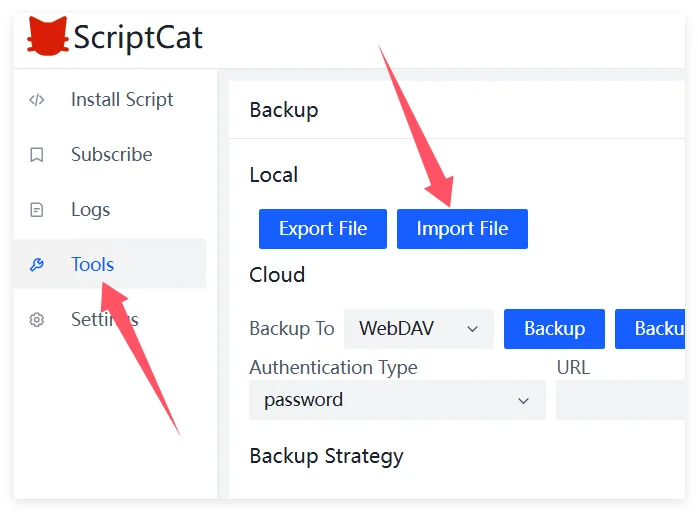

Wenn Sie derzeit Violentmonkey verwenden und zu ScriptCat migrieren möchten, finden Sie hier Schritte und Tipps für eine reibungslose Migration.

## Backup aus Violentmonkey exportieren

Klicken Sie zuerst auf das Violentmonkey-Symbol, um das Verwaltungspanel zu öffnen.

Klicken Sie auf `Einstellungen`, dann auf `Als zip-Datei exportieren`, um die Backup-Datei zu exportieren.

## Zu ScriptCat importieren

Klicken Sie in der ScriptCat-Erweiterung auf das Dashboard-Symbol, um das Verwaltungspanel zu öffnen.

Wählen Sie `Werkzeuge`, klicken Sie auf `Datei importieren`, wählen Sie die zuvor exportierte Violentmonkey zip-Datei und klicken Sie auf `Öffnen` zum Importieren.

Wählen Sie dann auf der neu geöffneten Seite die zu importierenden Skripte aus oder wählen Sie alle aus und klicken Sie auf die Schaltfläche `Importieren`.
