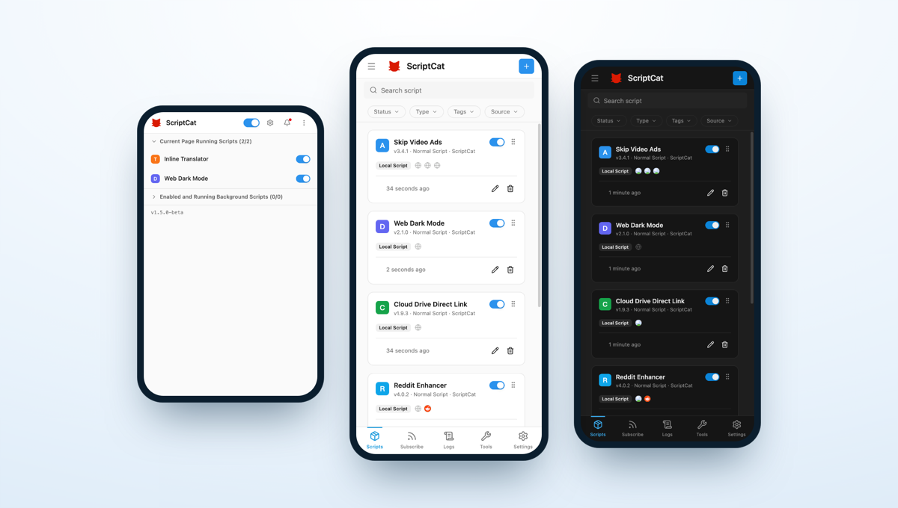

:::caution Testing Phase
v1.5 is currently still in a testing phase (Beta); the following features may change before the official release. Feedback from trying it out is welcome — you can also join the discussion about the new UI/UX in the [GitHub Discussions](https://github.com/scriptscat/scriptcat/discussions).
:::

v1.5 is a full rebuild of the ScriptCat interface: cleaner, more consistent, and easier to use — with dedicated optimizations for mobile so that both desktop and mobile users get a better experience.

## A Brand-New Interface [#1514](https://github.com/scriptscat/scriptcat/pull/1514)

The entire interface has been fully rebuilt, with a more consistent visual style, clearer hierarchy, and full light/dark theme support. The script list offers both table and card views, together with advanced filtering by status, type, tag, and source — so managing a lot of scripts stays comfortable.

## Mobile Optimizations

The layout is now purpose-built for mobile browsers that support extensions (such as Edge for Android and Kiwi): the script list is shown as cards, a bottom navigation bar is provided, a left-side drawer gives quick access to Subscriptions, Logs, Tools, and Settings, and the extension popup adapts to narrow screens.

## Choose Script Type from the Editor [#1544](https://github.com/scriptscat/scriptcat/pull/1544)

The editor tab bar's "＋" now lets you pick the type of script to create (normal / background / scheduled) directly, without returning to the list page.

## Manual Download for Local Backups [#1543](https://github.com/scriptscat/scriptcat/pull/1543)

Local backups now offer a manual download link to export the backup file directly to your device.

## structured_clone Messaging on Chromium 148+ [#1534](https://github.com/scriptscat/scriptcat/pull/1534)

On Chromium 148+, internal extension messages use `structured_clone` serialization, supporting a wider range of data types.

## Other Improvements

- **GM API**: native `GM_download` now honors `@connect`, consistent with `GM_xmlhttpRequest` [#1506](https://github.com/scriptscat/scriptcat/pull/1506)
- **Performance**: improved script-loading cache and fixed leftover popup menus [#1511](https://github.com/scriptscat/scriptcat/pull/1511)
- **Editor**: adjusted the `eslint-plugin-userscripts` rules [#1510](https://github.com/scriptscat/scriptcat/pull/1510)
- Pre-release (beta) updates now open the changelog page automatically
- **Fix**: avoid scheduled-task issues caused by cron auto-detecting an invalid time zone [#1531](https://github.com/scriptscat/scriptcat/pull/1531)
- **Fix**: replace an unavailable demo API in the crontab example [#1542](https://github.com/scriptscat/scriptcat/pull/1542)
- **i18n**: added Turkish
