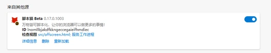

# Quick Start

> ScriptCat is a browser extension that can execute user scripts, everything can be scripted, making your browser capable of doing more!
>
> Continuously compatible with Tampermonkey scripts, already compatible with 90%+ Tampermonkey scripts, more Tampermonkey features are being improved, and additionally supports more powerful background scripts and scheduled scripts!
>
> If you find that your Tampermonkey script is not compatible, you can provide feedback at [GitHub Repo](https://github.com/scriptscat/scriptcat).

## Install Extension

You can install the extension from the following extension stores:

- [Microsoft Edge](https://microsoftedge.microsoft.com/addons/detail/scriptcat/liilgpjgabokdklappibcjfablkpcekh)
- [Google Chrome](https://chrome.google.com/webstore/detail/scriptcat/ndcooeababalnlpkfedmmbbbgkljhpjf)
- [Firefox](https://addons.mozilla.org/zh-CN/firefox/addon/scriptcat/)

### Other Browsers

If your browser is not in the above list, you can download the `zip`/`crx` file from the [Github Release](https://github.com/scriptscat/scriptcat/releases) page and install it manually.

### Load Unpacked Extension Installation

① First download the `zip` file from [Github Release](https://github.com/scriptscat/scriptcat/releases) or [Community Download](https://bbs.tampermonkey.net.cn/thread-3068-1-1.html) page. If it's a `crx` file, change its extension to `zip`.

② Prepare a folder for storing the plugin, and extract the above zip file to that folder. After extraction, it should look like this (**Note: This folder cannot be deleted or moved, otherwise the extension will not work properly**) 

③ Open the browser's extension management interface to load the unpacked extension (refer to [Enable developer mode to support manifest v3 ScriptCat](/docs/use/open-dev/) to enable developer mode first)

- 1. **Edge** 
- 2. **Chrome** 

④ Select the folder created in step ② (after loading is complete, the ScriptCat icon will appear in the extension list in the extension management interface, and you can also see it by clicking the extension button in the upper right corner of the browser's address bar)

- 1. **Edge** 
- 2. **Chrome** 

⑤ Click the ScriptCat icon in the upper right corner, click `┆` > Get Scripts in the upper right corner of the interface that appears, and you can go to the script site to search and install scripts.

Note: Extensions installed this way cannot be automatically updated. If you need to update, please repeat the above steps to update the extension (replace files and reload once).

## Get Scripts

> In addition to scripts, you can also get some script information and tutorials from [Tampermonkey Chinese Forum](https://bbs.tampermonkey.net.cn/) and [Script Development Guide](https://learn.scriptcat.org/).

### ScriptCat Script Site

[ScriptCat Script Site](https://scriptcat.org/) is the script site for this extension, where you can publish scripts you write.

- New script site
- Background scripts/scheduled scripts
- User-friendly interface

### Userscript.Zone Search

[Userscript.Zone Search](https://www.userscript.zone/?utm_source=tm.net&utm_medium=scripts) is a new website that allows searching for user scripts by entering appropriate URLs or domains.

- Large amount of script resources
- Easy to find suitable user scripts
- Only shows user scripts from reviewed user script pages or at least pages with comment functionality

### GreasyFork

[GreasyFork](https://greasyfork.org/) is perhaps the most popular script site. It was created by Jason Barnabe, who is also the founder of the [Stylish](https://userstyles.org/) website, and has a large amount of script resources in its repository.

- Large amount of script resources
- Has the ability to sync scripts from Github
- Very active [open source development model](https://github.com/JasonBarnabe/greasyfork)

### GitHub/Gist

You can [search for script resources in Github and Gist.](https://gist.github.com/search?l=JavaScript&o=desc&q="%3D%3DUserScript%3D%3D"&s=updated)
