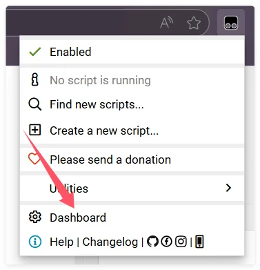
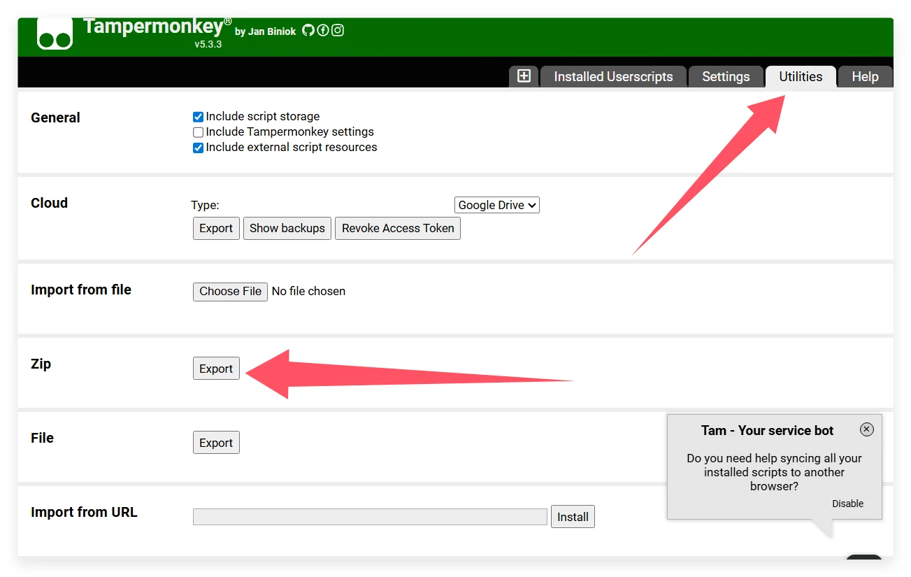
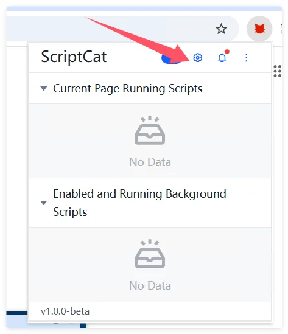
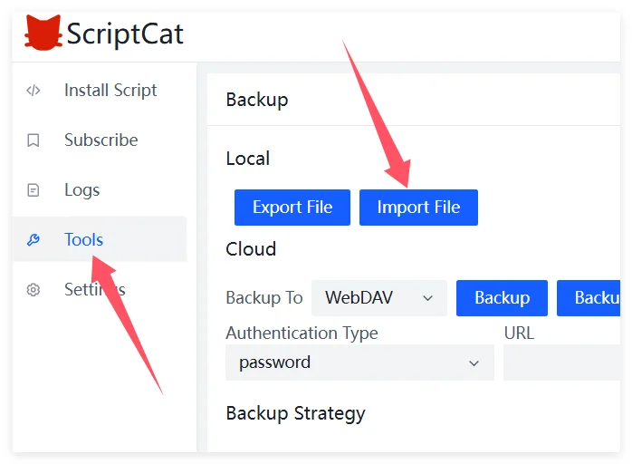

# Migrate from Tampermonkey to Scriptcat

If you are currently using Tampermonkey and want to migrate to Scriptcat, here are some steps and tips to help you complete the migration smoothly.

## Export Backup from Tampermonkey

First, click the Tampermonkey icon to enter the dashboard

Click `Utilities`, then click `Export` under the zip file section to export the zip file

## Import to Scriptcat

In the Scriptcat extension, click the dashboard icon to enter the management panel

Select `Tools`, then click `Import File`, choose the previously exported Tampermonkey zip file, and click `Open` to import.

Then in the newly opened page, select or select all the scripts you want to import, and click the `Import` button.
