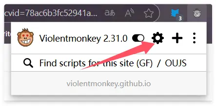
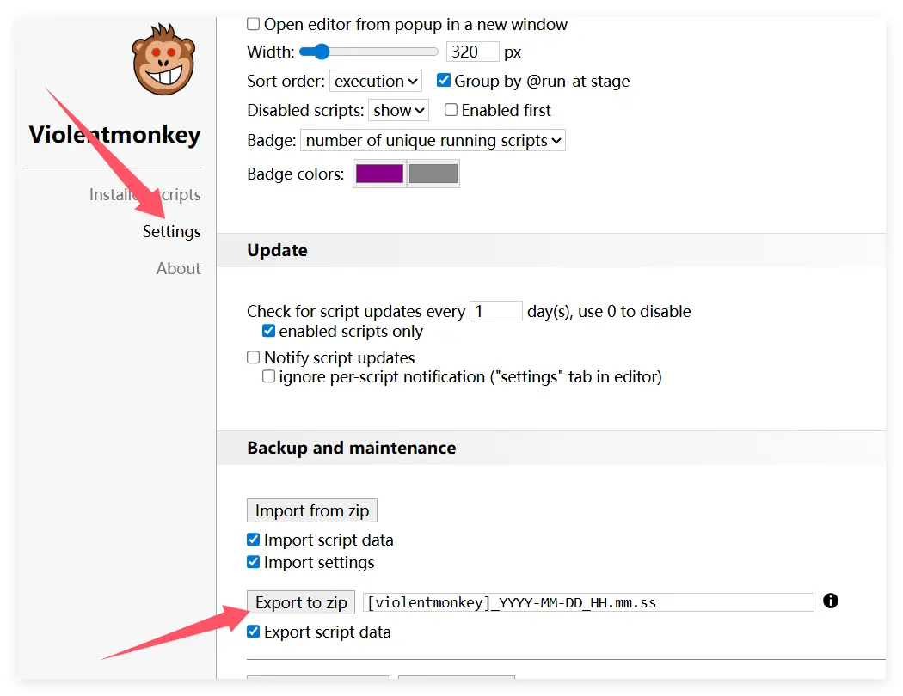

# Migrating from Violentmonkey to Scriptcat

If you are currently using Violentmonkey and want to migrate to Scriptcat, here are the steps and tips to help you complete the migration smoothly.

## Export Backup from Violentmonkey

First, click the Violentmonkey icon to enter the management panel

Click `Settings`, then click `Export as zip file` to export the backup file

## Import to Scriptcat

In the Scriptcat extension, click the dashboard icon to enter the management panel

Select `Tools`, then click `Import File`, choose the previously exported Violentmonkey zip file, and click `Open` to import.

Then in the newly opened page, select or select all the scripts you want to import, and click the `Import` button.
