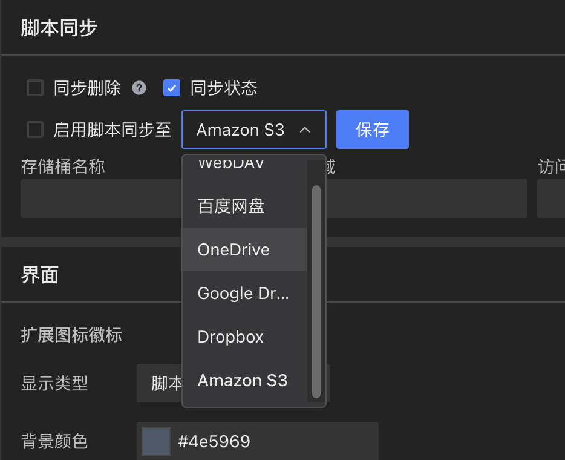

## جریان جدید نصب اسکریپت [#842](https://github.com/scriptscat/scriptcat/issues/842)

جریان نصب اسکریپت بازطراحی شد — دیگر به انتقال به وب‌سایت‌های خارجی یا باز کردن پنجره‌های جدید وابسته نیست. اسکریپت‌ها اکنون مستقیماً در صفحه فعلی نصب می‌شوند. چیدمان صفحه نصب نیز با طراحی واکنش‌گرا، پیش‌نمایش کد قابل پیمایش و نمایش خطای درون‌خطی هنگام شکست دانلود بهینه شده است.

## گزینه‌های زمان اجرای اسکریپت [#895](https://github.com/scriptscat/scriptcat/issues/895)

گزینه زمان اجرا در تنظیمات اسکریپت اضافه شد که به شما امکان می‌دهد از بین `document-start`، `document-body`، `document-end`، `document-idle`، `early-start` و موارد دیگر انتخاب کنید و کنترل دقیقی بر زمان اجرای اسکریپت خود داشته باشید.

## پشتیبانی از ذخیره‌سازی Amazon S3 [#1146](https://github.com/scriptscat/scriptcat/issues/1146)

همگام‌سازی و پشتیبان‌گیری ابری اکنون از Amazon S3 به عنوان بک‌اند ذخیره‌سازی پشتیبانی می‌کند، علاوه بر گزینه‌های موجود مانند WebDAV، Baidu Netdisk، OneDrive، Google Drive و Dropbox.

## جداسازی ذخیره‌سازی ابری [#1151](https://github.com/scriptscat/scriptcat/issues/1151)

دکمه جداسازی به تنظیمات همگام‌سازی ابری اضافه شد که قطع یا تغییر اتصالات ذخیره‌سازی ابری را آسان می‌کند.
