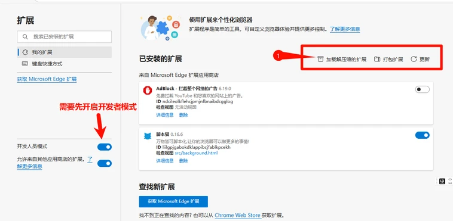

ScriptCat یک افزونه مرورگر است که می‌تواند اسکریپت‌های کاربری را اجرا کند، با اسکریپت‌های Tampermonkey سازگار است و امکانات بیشتری ارائه می‌دهد. اگر باگ‌هایی پیدا کردید یا پیشنهادی دارید، می‌توانید از [مخزن گیت‌هاب](https://github.com/scriptscat/scriptcat) بازخورد ارائه دهید.

## نصب افزونه

می‌توانید افزونه را از فروشگاه‌های افزونه زیر نصب کنید:

| مرورگر         | لینک فروشگاه                                                                                                                                                                                                                                     | وضعیت         |
| --------------- | ---------------------------------------------------------------------------------------------------------------------------------------------------------------------------------------------------------------------------------------------- | -------------- |
| Chrome          | [نسخه پایدار](https://chrome.google.com/webstore/detail/scriptcat/ndcooeababalnlpkfedmmbbbgkljhpjf) [نسخه بتا](https://chromewebstore.google.com/detail/%E8%84%9A%E6%9C%AC%E7%8C%AB-beta/jaehimmlecjmebpekkipmpmbpfhdacom?authuser=0&hl=zh-CN) | ✅ موجود    |
| Edge            | [نسخه پایدار](https://microsoftedge.microsoft.com/addons/detail/scriptcat/liilgpjgabokdklappibcjfablkpcekh) [نسخه بتا](https://microsoftedge.microsoft.com/addons/detail/scriptcat-beta/nimmbghgpcjmeniofmpdfkofcedcjpfi)                      | ✅ موجود    |
| Firefox         | [نسخه پایدار](https://addons.mozilla.org/zh-CN/firefox/addon/scriptcat/) [نسخه بتا](https://addons.mozilla.org/zh-CN/firefox/addon/scriptcat-pre/)                                                                                             | ✅ MV2         |

### سایر مرورگرها

اگر مرورگر شما در فهرست بالا نیست، می‌توانید فایل `zip`/`crx` را از صفحه [Github Release](https://github.com/scriptscat/scriptcat/releases) دانلود کرده و به صورت دستی نصب کنید.

### نصب افزونه از حالت بارگذاری نشده {#load-unpacked-extension-installation}

① ابتدا فایل `zip` را از صفحه [Github Release](https://github.com/scriptscat/scriptcat/releases) یا [دانلود انجمن](https://bbs.tampermonkey.net.cn/thread-3068-1-1.html) دانلود کنید. اگر فایل `crx` است، پسوند آن را به `zip` تغییر دهید.

② یک پوشه برای نگهداری افزونه آماده کنید و فایل zip بالا را در آن پوشه استخراج کنید. پس از استخراج، باید به این شکل باشد (**توجه: این پوشه را نمی‌توان حذف یا جابه‌جا کرد، در غیر این صورت افزونه به درستی کار نخواهد کرد**) 

③ رابط مدیریت افزونه مرورگر را باز کنید تا افزونه استخراج‌شده را بارگذاری کنید (برای فعال کردن حالت توسعه‌دهنده، ابتدا به [فعال‌سازی حالت توسعه‌دهنده برای پشتیبانی از manifest v3 ScriptCat](/docs/use/open-dev/) مراجعه کنید)

- 1. **Edge** 
- 2. **Chrome** 

④ پوشه ایجاد شده در مرحله ② را انتخاب کنید (پس از تکمیل بارگذاری، آیکون ScriptCat در فهرست افزونه‌ها در رابط مدیریت افزونه ظاهر می‌شود و همچنین می‌توانید با کلیک روی دکمه افزونه در گوشه بالا سمت راست نوار آدرس مرورگر آن را ببینید)

- 1. **Edge** 
- 2. **Chrome** 

⑤ روی آیکون ScriptCat در گوشه بالا سمت راست کلیک کنید، در رابط ظاهر شده روی `┆` > دریافت اسکریپت‌ها در گوشه بالا سمت راست کلیک کنید و می‌توانید به سایت اسکریپت بروید تا اسکریپت‌ها را جستجو و نصب کنید.

توجه: افزونه‌هایی که به این روش نصب می‌شوند نمی‌توانند به طور خودکار به‌روزرسانی شوند. اگر نیاز به به‌روزرسانی دارید، لطفاً مراحل بالا را برای به‌روزرسانی افزونه تکرار کنید (فایل‌ها را جایگزین کرده و یک بار بارگذاری مجدد انجام دهید).

## دریافت اسکریپت‌ها

> علاوه بر اسکریپت‌ها، می‌توانید برخی اطلاعات و آموزش‌های اسکریپت را نیز از [انجمن چینی Tampermonkey](https://bbs.tampermonkey.net.cn/) و [راهنمای توسعه اسکریپت](https://learn.scriptcat.org/) دریافت کنید.

### سایت اسکریپت ScriptCat

[سایت اسکریپت ScriptCat](https://scriptcat.org/) سایت اسکریپت این افزونه است، جایی که می‌توانید اسکریپت‌هایی که نوشته‌اید را منتشر کنید.

- سایت اسکریپت جدید
- اسکریپت‌های پس‌زمینه / اسکریپت‌های زمان‌بندی‌شده
- رابط کاربری کاربرپسند

### جستجوی Userscript.Zone

[جستجوی Userscript.Zone](https://www.userscript.zone/?utm_source=tm.net&utm_medium=scripts) وب‌سایت جدیدی است که امکان جستجوی اسکریپت‌های کاربری را با وارد کردن URLها یا دامنه‌های مناسب فراهم می‌کند.

- تعداد زیادی منابع اسکریپت
- یافتن اسکریپت‌های کاربری مناسب آسان است
- فقط اسکریپت‌های کاربری را از صفحات بررسی‌شده یا حداقل صفحات دارای قابلیت نظر نمایش می‌دهد

### GreasyFork

[GreasyFork](https://greasyfork.org/) یک پلتفرم پرکاربرد برای میزبانی و اشتراک‌گذاری اسکریپت‌های کاربری است که به توسعه‌دهندگان امکان انتشار و به کاربران امکان نصب اسکریپت‌های مبتنی بر مرورگر را می‌دهد که عملکرد وب‌سایت را بهبود یا تغییر می‌دهند. این سایت توسط Jason Barnabe ایجاد شده و به دلیل تأکید بر امنیت و شفافیت متن‌باز شناخته می‌شود و مجموعه بزرگی از اسکریپت‌ها را برای بهبود تجربه مرور ارائه می‌دهد.

Jason Barnabe همچنین خالق اصلی افزونه مرورگر Stylish است. با این حال، [Stylish](https://userstyles.org/) در سال ۲۰۱۶ فروخته شد و اکنون توسط شرکت دیگری اداره می‌شود و Jason Barnabe هیچ مشارکت مستقیمی در توسعه بعدی آن ندارد.

- تعداد زیادی منابع اسکریپت
- امکان همگام‌سازی اسکریپت‌ها از Github را دارد
- [مدل توسعه متن‌باز](https://github.com/JasonBarnabe/greasyfork) بسیار فعال

### GitHub/Gist

می‌توانید [منابع اسکریپت را در Github و Gist جستجو کنید.](https://gist.github.com/search?l=JavaScript&o=desc&q="%3D%3DUserScript%3D%3D"&s=updated)

## تور آشنایی

پس از نصب ScriptCat، باز کردن داشبورد به طور خودکار تور آشنایی را شروع می‌کند (همچنین می‌توانید در هر زمان از «مرکز راهنما» در نوار کناری سمت چپ آن را دوباره باز کنید). این تور شامل موارد زیر است:

- [نصب اسکریپت‌ها](/docs/use/script_installation/): نصب از بازارهای اسکریپت، از جمله پشتیبانی از [اسکریپت‌های پس‌زمینه](/docs/dev/background/).
- مدیریت و عملیات: ویرایش، اجرا/توقف، [UserConfig](/docs/dev/config/).
- [پشتیبان‌گیری](/docs/use/sync/) و [انتقال از سایر مدیرها](/docs/use/from-other/migrate-from-tampermonkey/).
- [همگام‌سازی اسکریپت](/docs/use/sync/).
- [اشتراک‌ها](/docs/dev/subscribe/).
