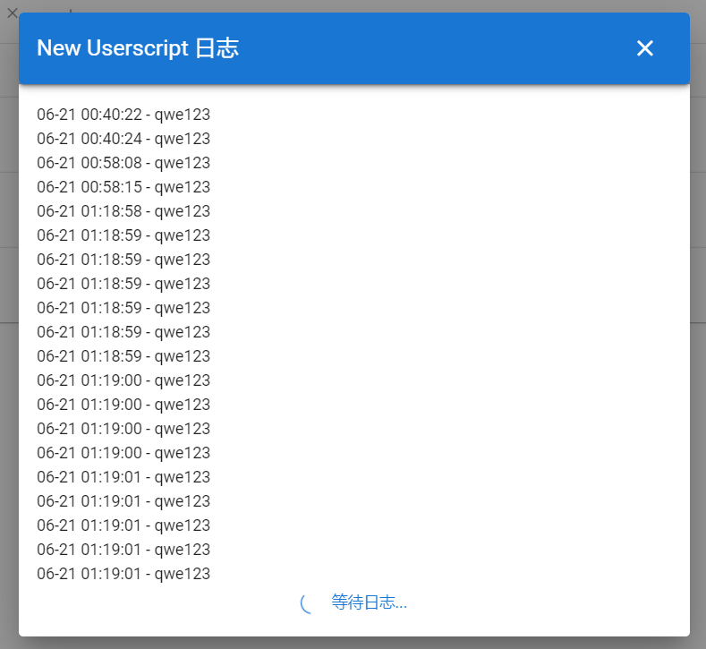
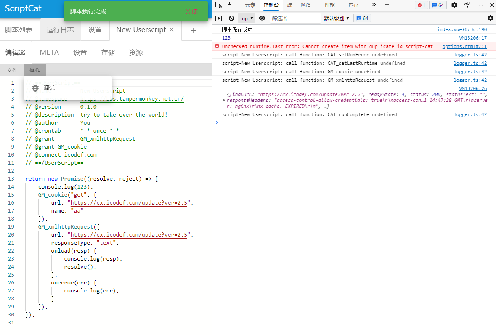
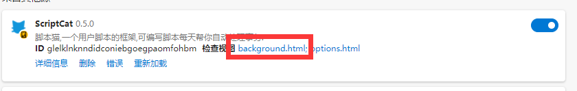

Les scripts en arrière-plan conviennent aux scripts fonctionnant en continu. Il s'agit d'un type de script propre à ScriptCat, qui s'exécute dans un bac à sable et ne peut pas manipuler le DOM. Le développement utilise les mêmes API GM que Tampermonkey ; les éventuelles différences de compatibilité sont indiquées dans la documentation.

## Scripts en arrière-plan (`@background`) {#background-script-background}

Un script en arrière-plan se déclare via l'attribut `@background`, qui permet au script de continuer à s'exécuter en arrière-plan une fois activé ou après le démarrage du navigateur.

## Scripts planifiés (`@crontab`) {#scheduled-script-crontab}

> Un script planifié est un type de script en arrière-plan, adapté aux tâches **exécutées de façon répétée selon un cycle temporel**.

Un script planifié se déclare via l'attribut `@crontab`, avec un ordonnancement à la minute ou à la seconde, et propose la syntaxe étendue de ScriptCat `once` / `once(...)` pour éviter les exécutions répétées au sein d'un même cycle.

⚠️ Points d'attention :

* Dans un script, **seul le premier `@crontab` prend effet**
* Il est recommandé que **le temps d'exécution unique + le temps de nouvelle tentative** ne dépasse pas l'intervalle du cron, sous peine de chevauchement d'exécutions

## Description de l'expression Cron

Le cron de ScriptCat est basé sur [**node-cron**](https://github.com/kelektiv/node-cron/), avec quelques extensions par rapport à la syntaxe cron standard.

### Format de l'expression

#### Format standard à 5 champs (recommandé)

```text
minute heure jour mois jour-de-la-semaine
```

#### Format étendu à 6 champs (déconseillé)

```text
seconde minute heure jour mois jour-de-la-semaine
```

> ⚠️ Le format à 6 champs est déconseillé
> L'environnement du navigateur ne peut pas garantir une exécution précise à la seconde près, et cela augmente la charge de calcul ; la page d'arrière-plan peut voir son ordonnancement retardé.

### Syntaxe disponible pour chaque champ

| Syntaxe | Signification | Exemple |
| ------- | -------- | -------------- |
| `*`     | N'importe quelle valeur | `*` (chaque minute / chaque heure) |
| Nombre  | Valeur précise | `5` (la 5e minute) |
| `a,b,c` | Plusieurs valeurs discrètes | `1,15,30` |
| `a-b`   | Intervalle continu | `10-23` |
| `*/n`   | Toutes les n unités | `*/5` |
| `a-b/n` | Pas au sein d'un intervalle | `10-50/10` |

#### Règles pour le jour de la semaine (day of week)

* `1–6` : lundi à samedi
* `0` ou `7` : dimanche

## Description de la syntaxe étendue `once`

### Signification de `once`

Utiliser `once` dans une expression cron signifie :

> **Une seule exécution réussie est autorisée au sein du cycle temporel courant**

Même si des instants ultérieurs du même cycle correspondent toujours à la règle cron, l'exécution ne se répète pas.

### Différence entre `once` et `once(...)`

| Syntaxe      | Valeur cron correspondante pour ce champ | Description                              |
| ----------- | ------------- | ------------------------------- |
| `once`      | `*` (n'importe quelle valeur) | Exécution à la première correspondance du cycle, sans instant précis imposé |
| `once(expr)` | `expr`        | Exécution uniquement aux instants correspondant à `expr`, une seule fois |

`once(expr)` permet de limiter l'exécution à « une fois par cycle » tout en précisant les instants candidats. Les parenthèses acceptent toute la syntaxe cron standard (nombres, intervalles, pas, listes).

Exemples comparatifs :

```text
* once * * *          // n'importe quelle minute de chaque heure, exécution à la première correspondance, plus d'exécution le reste de l'heure
* once(9-17) * * *    // entre 9h et 17h chaque jour, une exécution par heure
0,30 once * * *       // à la minute 0 ou 30 de chaque heure, exécution à la première correspondance atteinte, plus d'exécution le reste de l'heure
```

### La position de `once` = le cycle temporel limité

Selon la position où `once` / `once(...)` est écrit, l'exécution est limitée à « une seule fois par unité de temps correspondante ».

| Position de `once` | Signification     |
| --------- | -------- |
| Minute        | Une seule exécution par minute |
| Heure        | Une seule exécution par heure |
| Jour        | Une seule exécution par jour  |
| Mois        | Une seule exécution par mois  |
| Jour de la semaine        | Une seule exécution par semaine  |

Exemples :

```text
* once * * *       // une seule exécution par heure
* * once * *       // une seule exécution par jour
* 9-18 once * *    // une seule exécution entre 9h et 18h chaque jour
```

### Comportement combiné de `once` avec intervalles / listes / pas

`once` / `once(...)` peut se combiner avec n'importe quelle syntaxe cron, avec une seule règle :

> **Au sein d'un même cycle, dès qu'une exécution a réussi, tous les autres instants correspondants sont ignorés**

#### Exemple 1 : intervalle

```text
* 10 once * *
```

Signification :

* Chaque jour, 10:00–10:59 sont des instants candidats
* Après la première exécution du jour
* 10:05–10:59 ne s'exécuteront plus

#### Exemple 2 : liste

```text
* 1,3,5 once * *
```

Signification :

* Chaque jour, 1h, 3h et 5h sont des instants candidats
* Si 1h s'est déjà exécuté
* 3h et 5h seront ignorés

#### Exemple 3 : pas

```text
* */4 once * *
```

Signification :

* Chaque jour, 0h, 4h, 8h, 12h, 16h, 20h sont des instants candidats
* Après la première exécution du jour
* Les autres instants ne s'exécuteront plus

#### Exemple 4 : `once(...)` avec instants candidats précis

```text
* once(9-17) * * *
```

Signification :

* Chaque jour, 9h à 17h sont des heures candidates
* Le cycle se réinitialise chaque heure ; après la première correspondance dans l'heure, plus d'exécution
* Effet : entre 9h et 17h chaque jour, une exécution par heure, soit 9 exécutions au total

```text
* 9-18 once * *
```

Signification :

* Chaque jour, 9:00–18:59 sont des instants candidats
* Le `once` au niveau du jour verrouille le cycle quotidien
* Après la première exécution du jour, plus d'exécution avant 18:59

## Exemples de `@crontab`

### Cas courants

```js
//@crontab * * * * *        // exécution chaque minute
//@crontab * * * * * *      // exécution chaque seconde (déconseillé)
//@crontab 0 */6 * * *      // exécution toutes les 6 heures pile
//@crontab 15 */6 * * *     // exécution à la 15e minute de chaque tranche de 6 heures
//@crontab * once * * *     // au maximum une exécution par heure
//@crontab * * once * *     // au maximum une exécution par jour
//@crontab * 10 once * *    // une seule exécution dans la tranche 10h (si exécuté à 10h04, aucune exécution entre 10h05 et 10h59)
//@crontab * */4 once * *   // vérification toutes les 4 heures (une seule exécution max) (si exécuté à 4h, aucune exécution à 8h, 12h, 16h, 20h, 24h, etc.)
```

### Cas avancés

```js
//@crontab * 1,3,5 once * *       // une exécution parmi 1h, 3h, 5h chaque jour (si exécuté à 1h, aucune exécution à 3h ni 5h)
//@crontab * 10-23 once * *       // une exécution entre 10h et 23:59 chaque jour (si exécuté à 10h04, aucune exécution entre 10h05 et 23:59)
//@crontab * once 13 * *          // une exécution par heure, le 13 de chaque mois
//@crontab * once(9-17) * * *     // une exécution par heure entre 9h et 17h chaque jour
//@crontab 0,30 once * * *        // exécution à la minute 0 ou 30, la première atteinte, sans répétition dans l'heure
//@crontab * 9-18 once * *        // une seule exécution entre 9h et 18h chaque jour
```

## Recommandations d'usage

### Cas adaptés à `once`

* Tâches ne nécessitant **qu'une seule exécution** par jour / heure
* Scripts de vérification d'état, de synchronisation, de rapport
* Pour éviter les problèmes suivants :

  * Navigateur resté fermé longtemps
  * Retard d'ordonnancement de la page d'arrière-plan
  * Exécutions répétées dues à un redémarrage du navigateur

### Cas déconseillés pour `once`

* Tâches devant s'exécuter précisément à un instant donné
* Scripts dont le temps d'exécution peut dépasser nettement l'intervalle cron
* Tâches exigeant une cohérence stricte du nombre d'exécutions

## Tester une expression Cron

Pour tester une expression cron, **remplacez temporairement** `once` / `once(...)` par la valeur correspondante :

* `once` → `*`
* `once(expr)` → `expr`

Attention : certains outils de test ne prennent pas en charge le format étendu à 6 champs.

Outils recommandés :

* [crontab.guru](https://crontab.guru/)
* [calculateur cron de tool.lu](https://tool.lu/crontab/)

Sur la page de liste des scripts, survolez la **barre de statut d'exécution** pour voir la **prochaine heure d'exécution** du script.

## Journaux

Sur la page de liste des scripts, survolez la `barre de statut d'exécution` pour voir l'état d'exécution du script ; un clic ouvre le contenu des journaux affichés via `GM_log`.




## Débogage de script

Un script en arrière-plan peut être débogué directement dans la page d'édition du script, avec toutefois les limitations suivantes :

* Les value ne se synchronisent pas correctement
* Les menus registerMenu ne se déclenchent pas correctement



Pour déboguer dans l'environnement d'exécution réel, activez le **mode développeur** dans les paramètres de l'extension, puis ouvrez la page `background.html` de l'extension pour déboguer.

Les erreurs générées à l'exécution sont également consultables dans le journal d'exécution.



## Promise

L'écriture suivante est fortement recommandée, car elle facilite aussi le suivi du script par le gestionnaire.
Si le script contient des opérations asynchrones, il **doit obligatoirement retourner une `Promise`**.

```ts
// ==UserScript==
// @name         Script en arrière-plan
// @namespace    wyz
// @version      1.0.0
// @author       wyz
// @background
// ==/UserScript==
return new Promise((resolve, reject) => {
  if (Math.round((Math.random() * 10) % 2)) {
    resolve("ok"); // exécution réussie
  } else {
    reject("error"); // échec de l'exécution, avec la raison de l'erreur
  }
});
```

```js
// ==UserScript==
// @name         Script planifié s'exécutant une fois par jour
// @namespace    wyz
// @version      1.0.0
// @author       wyz
// @crontab      * * once * *
// ==/UserScript==
return new Promise((resolve, reject) => {
  if (Math.round((Math.random() * 10) % 2)) {
    resolve("ok"); // exécution réussie
  } else {
    reject("error"); // échec de l'exécution, avec la raison de l'erreur
  }
});
```

```js
// ==UserScript==
// @name         Appel d'API
// @namespace    wyz
// @version      1.0.0
// @author       wyz
// @crontab      * * once * *
// ==/UserScript==
return new Promise((resolve, reject) => {
  GM_xmlhttpRequest({
    url: "https://bbs.tampermonkey.net.cn/",
    onload() {
      resolve("ok"); // exécution réussie
    },
    onerror() {
      reject("error"); // échec de l'exécution, avec la raison de l'erreur
    },
  });
});
```

Veillez à placer `resolve / reject` uniquement une fois la logique du script réellement terminée.
Une fois appelé, le gestionnaire considère que le script a fini de s'exécuter, et les opérations GM suivantes n'auront plus d'effet.

## Nouvelle tentative en cas d'erreur

Les scripts en arrière-plan de ScriptCat prennent en charge les nouvelles tentatives en cas d'erreur.
Lorsque l'exécution du script échoue, il est possible de faire un `reject` avec une `CATRetryError` pour déclencher une nouvelle tentative.

* Délai minimal avant nouvelle tentative : 5 secondes
* Évitez tout conflit avec le temps d'exécution du script lui-même, sous peine d'exécutions répétées

```js
// ==UserScript==
// @name         Exemple de nouvelle tentative
// @namespace    https://bbs.tampermonkey.net.cn/
// @version      0.1.0
// @description  try to take over the world!
// @author       You
// @crontab      * * once * *
// @grant        GM_notification
// ==/UserScript==

return new Promise((resolve, reject) => {
  GM_notification({
    title: "retry",
    text: "Nouvelle tentative dans 10 secondes",
  });
  reject(new CATRetryError("Erreur xxx", 10));
});
```
