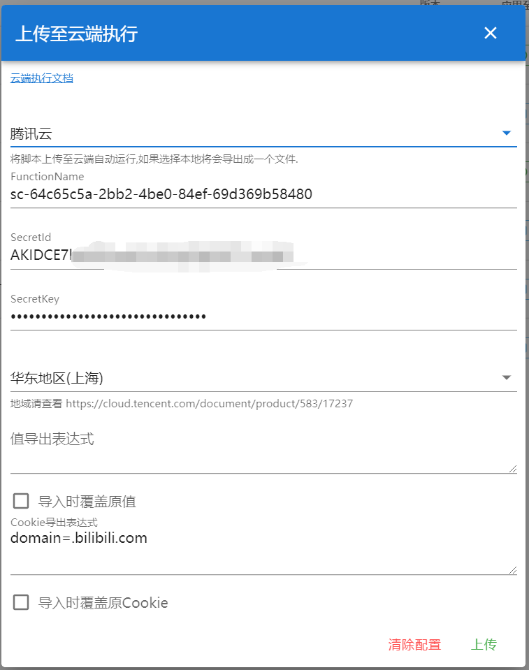

> Plusieurs modes d'exécution dans le cloud sont proposés, voir [Environnements d'exécution](#environnements-dexécution) pour plus de détails. Par ailleurs, [CloudCat](https://github.com/scriptscat/cloudcat) est un service dédié à l'exécution de scripts en arrière-plan dans le cloud, une plateforme FaaS encore en développement.

⚠ Attention ⚠ : une fois envoyée dans le cloud, la sémantique de `once` dans les expressions de script planifié change : le champ précédant `once` est remplacé par sa valeur minimale.

Par exemple :

* `* * once * *` => `0 0 * * *` — « une fois par jour » devient « tous les jours à 00:00 »
* `* 1-23 once * *` => `0 1 * * *` — « une fois entre 1h et 23h chaque jour » devient « tous les jours à 01:00 »
* `* 1,3,5 once * *` => `0 1 * * *` — « une fois à 1h, 3h ou 5h chaque jour » devient « tous les jours à 01:00 »
* `* */4 once * *` => `0 0 * * *` — « une fois toutes les 4 heures chaque jour » devient « tous les jours à 00:00 »
* `* 1-23/4 once * *` => `0 1 * * *` — « une fois toutes les 4 heures entre 1h et 23h » devient « tous les jours à 01:00 »
* `* 10 once * *` => `0 10 * * *` — « une fois à 10h chaque jour » devient « tous les jours à 10h00 »
* `* * * once *` => `0 0 1 * *` — « une fois par mois » devient « le 1er de chaque mois à 00:00 »

## Directives spécifiques à CloudCat

Un script de référence : [connexion automatique bilibili](https://scriptcat.org/script-show-page/48)

### cloudCat

Déclarer cette directive rend le script exécutable via `CloudCat` : un bouton d'exécution cloud apparaît alors dans la liste des scripts, permettant de choisir le mode d'exécution — voir [Environnements d'exécution](#environnements-dexécution).


### cloudServer

> Lié à CloudCat, pas encore implémenté

Adresse par défaut du serveur CloudCat.


### exportValue

Décrit les Value à exporter vers le cloud ; plusieurs déclarations sont possibles.

```ts
// @exportValue key1,key2,key3
// @exportValue key4,key5,key6
```

### exportCookie

Décrit les cookies à exporter vers le cloud ; plusieurs déclarations sont possibles. Les paramètres suivent le format `CookieDetails` de `GM_cookie`, par exemple :

```ts
// Exporte le cookie nommé cookie1 pour https://docs.scriptcat.org/docs/use/
// @exportCookie url=https://docs.scriptcat.org/docs/use;name=cookie1

// Exporte tous les cookies du domaine scriptcat.org
// @exportCookie domain=scriptcat.org

// Liste complète des paramètres disponibles :
// @exportCookie domain=scriptcat.org;url=https://docs.scriptcat.org/docs/use;name=cookie1;path=/docs/use;secure=true;session=true
```

## Changements de compatibilité des API
> Seules les API suivantes sont actuellement prises en charge ; sauf mention contraire, elles se comportent comme l'API d'origine.

### GM_xmlhttpRequest


### GM_notification


### GM_log

### GM_getValue

Seule la récupération des value exportées via `@exportValue` est actuellement prise en charge ; les méthodes set/delete/list ne le sont pas.

## Environnements d'exécution

### Local

Un fichier zip est généré ; une fois décompressé, exécutez les commandes suivantes dans le dossier pour lancer l'exécution en local (nécessite Node.js installé) :

```bash
npm i
node index.js
```


### Tencent Cloud

Créez d'abord une clé Tencent Cloud dans [**Clés d'accès**](https://console.cloud.tencent.com/cam/capi) — pour un sous-compte, veillez à lui attribuer les permissions nécessaires sur les fonctions cloud. Activez ensuite le service dans [**Function Service**](https://console.cloud.tencent.com/scf/list), qui offre un quota gratuit mensuel ; la région par défaut est Shanghai, modifiable si besoin. Après l'envoi, un déclencheur planifié est automatiquement créé à partir de `@crontab` pour exécuter la fonction selon le calendrier défini.


