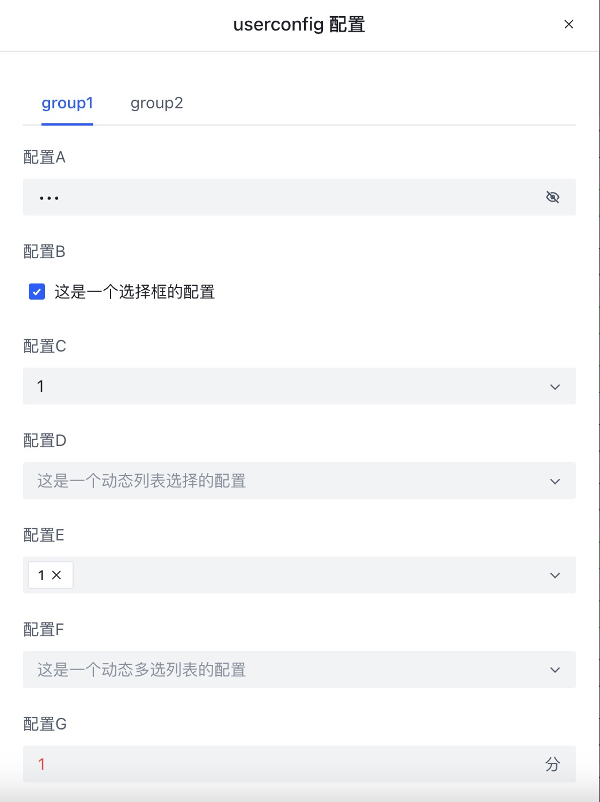

Le contenu du bloc `==UserConfig==` doit se trouver après le bloc `==UserScript==` et décrit les paramètres de configuration exposés à l'utilisateur. Ces informations sont écrites au format [YAML](https://yaml.org/) :

```js
/* ==UserConfig==
group1:
  configA:                                # La clé est group.config, par exemple ici : group1.configA
    title: Configuration A                # Titre de la configuration
    description: Configuration de type texte    # Description de la configuration
    type: text                            # Type de champ ; s'il est omis, il est détecté automatiquement à partir des données
    default: valeur par défaut            # Valeur par défaut de la configuration
    min: 2                                # Longueur minimale du texte : 2 caractères
    max: 18                               # Longueur maximale du texte : 18 caractères
    password: true                        # Définir comme champ mot de passe
  configB:
    title: Configuration B
    description: Configuration de type case à cocher
    type: checkbox
    default: true
  configC:
    title: Configuration C
    description: Configuration de type liste déroulante
    type: select
    default: 1
    values: [1,2,3,4,5]
  configD:
    title: Configuration D
    description: Configuration de type liste déroulante dynamique
    type: select
    bind: $cookies                       # Liaison dynamique des valeurs affichées ; la valeur est une clé commençant par $, dont la valeur doit être un tableau
  configE:
    title: Configuration E
    description: Configuration de type liste à sélection multiple
    type: mult-select
    default: [1]
    values: [1,2,3,4,5]
  configF:
    title: Configuration F
    description: Configuration de type liste à sélection multiple dynamique
    type: mult-select
    bind: $cookies
  configG:
    title: Configuration G
    description: Configuration de type nombre
    type: number
    default: 1
    min: 10  # valeur minimale
    max: 16  # valeur maximale
    unit: min # unité affichée
  configH:
    title: Configuration H
    description: Configuration de type texte long
    type: textarea
    default: valeur par défaut
  configI:
    title: Configuration I
    description: Configuration de type heure
    type: time
    default: "12:00"
---
group2: # Deuxième groupe de configuration
  configX:
    title: Configuration X
    description: Configuration de type texte
    default: valeur par défaut
 ==/UserConfig== */
```

Une fois cette définition en place, un bouton de configuration apparaît dans le panneau de contrôle pour que l'utilisateur puisse renseigner ces valeurs ; le développeur récupère ensuite la valeur via `GM_getValue`, la clé étant de la forme `group.config`.


