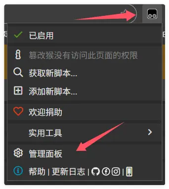
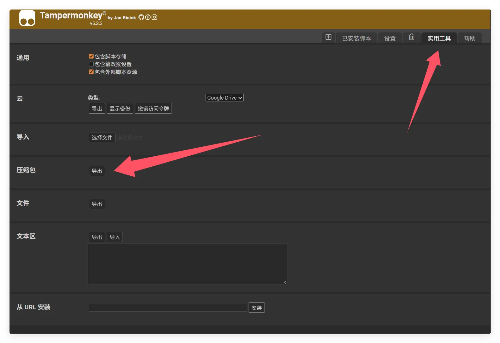
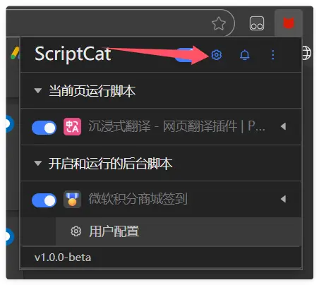
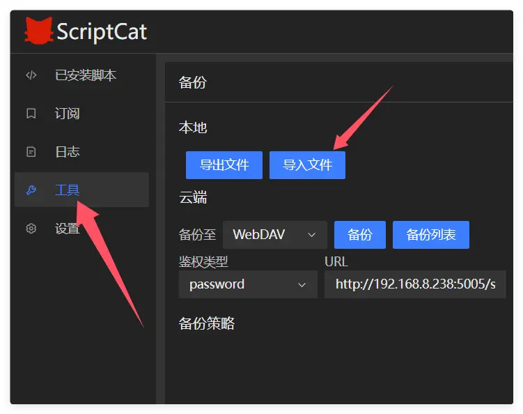

Si vous utilisez actuellement Tampermonkey et souhaitez passer à ScriptCat, voici quelques étapes et conseils pour vous aider à migrer en toute simplicité.

## Exporter une sauvegarde depuis Tampermonkey

Cliquez d'abord sur l'icône Tampermonkey pour ouvrir le panneau de gestion.

Cliquez sur `Utilitaires`, puis sur `Exporter` dans la section archive, pour exporter un fichier compressé.

## Importer dans ScriptCat

Dans l'extension ScriptCat, cliquez sur l'icône du panneau de contrôle pour ouvrir le panneau de gestion.

Sélectionnez `Outils`, puis cliquez sur `Importer un fichier`, choisissez le fichier compressé Tampermonkey exporté précédemment, et cliquez sur `Ouvrir` pour l'importer.

Dans la nouvelle fenêtre qui s'affiche, sélectionnez (ou sélectionnez tout) les scripts à importer, puis cliquez sur le bouton `Importer`.
