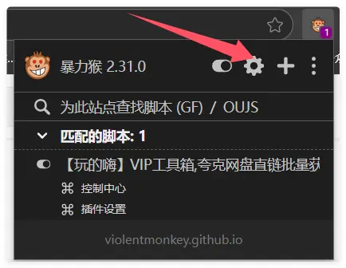
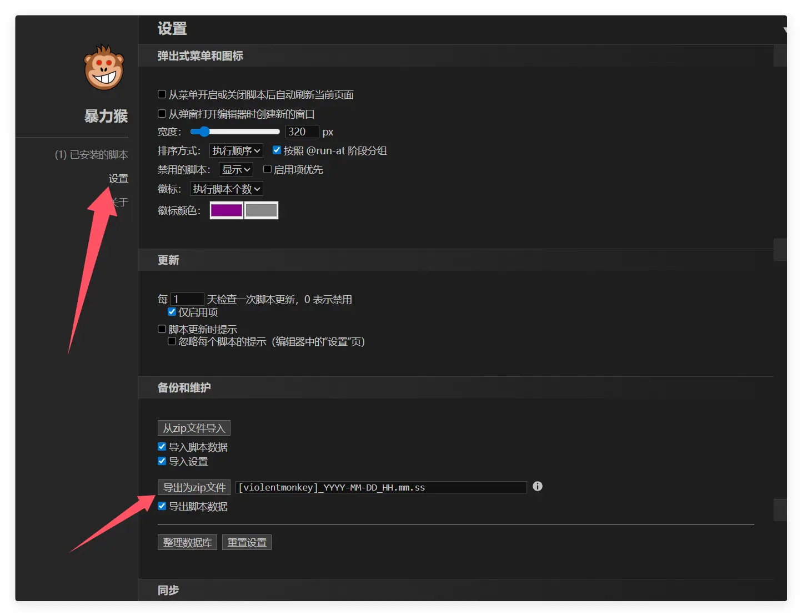

Si vous utilisez actuellement Violentmonkey et souhaitez passer à ScriptCat, voici quelques étapes et conseils pour vous aider à migrer en toute simplicité.

## Exporter une sauvegarde depuis Violentmonkey

Cliquez d'abord sur l'icône Violentmonkey pour ouvrir le panneau de gestion.

Cliquez sur `Paramètres`, puis sur `Exporter en fichier zip`, pour exporter un fichier compressé.

## Importer dans ScriptCat

Dans l'extension ScriptCat, cliquez sur l'icône du panneau de contrôle pour ouvrir le panneau de gestion.

Sélectionnez `Outils`, puis cliquez sur `Importer un fichier`, choisissez le fichier compressé Violentmonkey exporté précédemment, et cliquez sur `Ouvrir` pour l'importer.

Dans la nouvelle fenêtre qui s'affiche, sélectionnez (ou sélectionnez tout) les scripts à importer, puis cliquez sur le bouton `Importer`.
