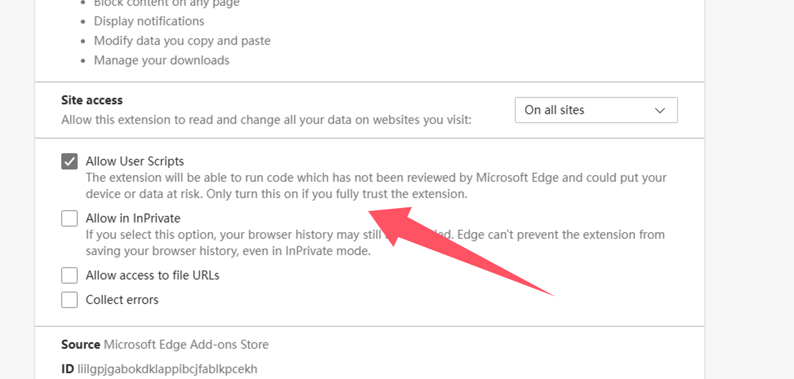

import Tabs from '@theme/Tabs';
import TabItem from '@theme/TabItem';
import { Icon } from "@iconify/react";
import BrowserGuide from '@site/src/components/BrowserGuide';
import GithubStar from '@site/src/components/GithubStar';

<GithubStar variant="bar" scene="install" />

<BrowserGuide texts={{
  allowUserScripts: {
    title: "Votre navigateur prend en charge « Allow User Scripts »",
    description: "Suivez les étapes ci-dessous pour activer l'option « Allow User Scripts » afin d'utiliser ScriptCat normalement.",
    button: "Voir les étapes",
    anchor: "#allow-user-scripts",
  },
  devMode: {
    title: "Votre navigateur doit avoir le « mode développeur » activé",
    description: "Suivez les étapes ci-dessous pour activer le « mode développeur » afin d'utiliser ScriptCat normalement.",
    button: "Voir les étapes",
    anchor: "#enable-developer-mode",
  },
  legacy: {
    title: "La version de votre navigateur est trop ancienne",
    description: "Votre navigateur ne prend pas en charge Manifest V3. Vous devez installer manuellement l'ancienne version de ScriptCat (v0.16.x). Voir les instructions ci-dessous.",
  },
  nonChromium: {
    title: "Navigateur basé sur Chromium non détecté",
    description: "ScriptCat ne prend actuellement en charge que les navigateurs basés sur Chromium (tels que Chrome, Edge, etc.). Si vous utilisez un navigateur basé sur Chromium, ignorez ce message et suivez les étapes ci-dessous.",
  },
}} />

## Activer les « User Scripts » {#allow-user-scripts}

[Allow User Scripts](https://developer.chrome.com/docs/extensions/reference/api/userScripts?hl=en#chrome_versions_138_and_newer_allow_user_scripts_toggle) est une nouvelle fonctionnalité de Manifest V3 qui permet aux scripts utilisateur de s'exécuter dans le navigateur.

<Tabs groupId="browser" queryString>
  <TabItem value="edge" label={
<Icon height={16} width={16} icon="logos:microsoft-edge" />Edge
} default>

① Ouvrez l'interface de gestion des extensions du navigateur, ou visitez [edge://extensions/](edge://extensions/)

② Dans l'interface de gestion des extensions, trouvez l'extension ScriptCat et cliquez sur `Détails`

③ Dans la page de détails de l'extension ScriptCat, trouvez l'option `Allow user scripts` et activez-la. Ensuite, désactivez puis réactivez l'extension, ou redémarrez le navigateur pour que les scripts fonctionnent.

> ⚠️⚠️⚠️ Pour les anciennes versions d'Edge (\<=143) ou les utilisateurs sans cette option, veuillez vous référer à [Activer le mode développeur](#enable-developer-mode)

  </TabItem>
  <TabItem value="chrome" label={
<Icon height={16} width={16} icon="logos:chrome" />Chrome
}>

① Ouvrez l'interface de gestion des extensions du navigateur, ou visitez [chrome://extensions/](chrome://extensions/)

② Dans l'interface de gestion des extensions, trouvez l'extension ScriptCat et cliquez sur `Détails`

③ Dans la page de détails de l'extension ScriptCat, trouvez l'option `Allow user scripts` et activez-la. Ensuite, désactivez puis réactivez l'extension, ou redémarrez le navigateur pour que les scripts fonctionnent.

</TabItem>
  <TabItem value="edge-mobile" label={
<Icon height={16} width={16} icon="logos:microsoft-edge" />Edge Mobile
}>

Pour Edge Mobile avec une version du moteur de navigateur ≥ 138, le mode développeur n'est pas requis. Activez plutôt `Allow user scripts` dans les paramètres de l'extension.

① Ouvrez la liste des extensions d'Edge Mobile, trouvez l'extension ScriptCat et appuyez sur le bouton `⋮` à droite

② Dans la fenêtre des paramètres de l'extension, activez `Allow user scripts`

③ Désactivez puis réactivez l'extension, ou redémarrez le navigateur pour que les scripts fonctionnent.

> ⚠️⚠️⚠️ Pour les versions du moteur de navigateur inférieures à 138, ou les utilisateurs sans cette option, veuillez vous référer à [Activer le mode développeur](#enable-developer-mode)

  </TabItem>
</Tabs>

## Activer le mode développeur {#enable-developer-mode}

<Tabs groupId="browser" queryString>
  <TabItem value="edge" label={
<Icon height={16} width={16} icon="logos:microsoft-edge" />Edge
} default>

① Ouvrez l'interface de gestion des extensions du navigateur, ou visitez [edge://extensions/](edge://extensions/)

② Activez le `mode développeur` (dans certains navigateurs, ce mode peut se trouver dans d'autres options, par exemple Navigateur 360 : Gestion avancée > Mode développeur)

③ Après avoir activé le mode développeur, désactivez puis réactivez l'extension, ou redémarrez le navigateur pour que les scripts fonctionnent.

  </TabItem>
  <TabItem value="chrome" label={
<Icon height={16} width={16} icon="logos:chrome" />Chrome
}>

① Ouvrez l'interface de gestion des extensions du navigateur, ou visitez [chrome://extensions/](chrome://extensions/)

② Activez le `mode développeur` (dans certains navigateurs, ce mode peut se trouver dans d'autres options, par exemple Navigateur 360 : Gestion avancée > Mode développeur)

③ Après avoir activé le mode développeur, désactivez puis réactivez l'extension, ou redémarrez le navigateur pour que les scripts fonctionnent.

  </TabItem>

<TabItem value="edge-mobile" label={
<Icon height={16} width={16} icon="logos:microsoft-edge" />Edge Mobile
}>

Pour Edge Mobile avec une version du moteur de navigateur inférieure à 138, ou sans l'option `Allow user scripts`, appuyez sur le bouton de paramètres en haut de la page des extensions pour activer le mode développeur.

</TabItem>

</Tabs>

:::warning Avis de version héritée

Si vous utilisez Windows 8/7/XP, ou si la version du moteur de votre navigateur est inférieure à 120, vous devez installer manuellement l'[ancienne version de ScriptCat](https://bbs.tampermonkey.net.cn/thread-3068-1-1.html). v0.16.x est la dernière version prenant en charge Manifest V2. Les étapes d'installation se trouvent ici : [Installation de l'extension non empaquetée](/docs/use/use/#load-unpacked-extension-installation).

:::

Contexte technique : Manifest V3

En raison des restrictions des navigateurs, les extensions sont obligées de passer à Manifest V3, et les extensions Manifest V2 seront complètement abandonnées après juin 2025. Dans le cadre des limitations de Manifest V3, vous devez activer le mode développeur ou la fonctionnalité des scripts utilisateur pour utiliser l'extension ScriptCat normalement.

Références : [Mode développeur pour les utilisateurs d'extensions](https://developer.chrome.com/docs/extensions/reference/api/userScripts?hl=en#developer_mode_for_extension_users), [Manifest V3](https://developer.chrome.com/docs/extensions/develop/migrate/what-is-mv3?hl=en)

Pour les versions du moteur de navigateur ≥ 138, vous devez activer « Allow User Scripts ». Pour les versions inférieures, utilisez « Activer le mode développeur ».

