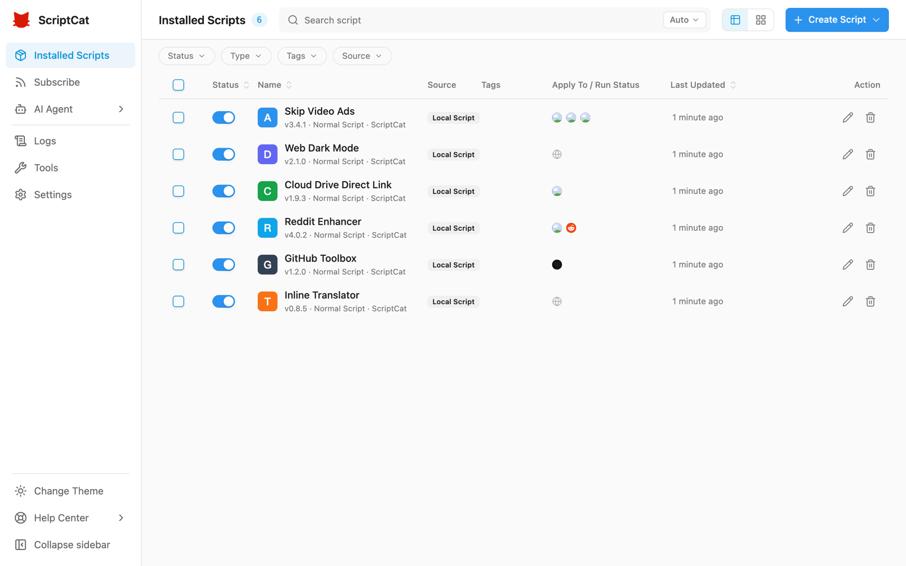

:::caution Փորձարկման փուլ
v1.5-ը ներկայումս գտնվում է փորձարկման փուլում (բետա). հետևյալ գործառույթները կարող են փոխվել մինչև պաշտոնական թողարկումը: Ձեր արձագանքը ողջունվում է. կարող եք նաև միանալ նոր UI/UX-ի քննարկմանը [GitHub Discussions](https://github.com/scriptscat/scriptcat/discussions)-ում:
:::

v1.5-ը ScriptCat ինտերֆեյսի ամբողջական վերակառուցում է. ավելի մաքուր, ավելի հետևողական և ավելի հեշտ օգտագործման համար, բջջայինի համար հատուկ օպտիմիզացիաներով, որպեսզի և՛ սեղանադիր, և՛ բջջային օգտատերերն ավելի լավ փորձ ստանան:

## Բոլորովին նոր ինտերֆեյս [#1514](https://github.com/scriptscat/scriptcat/pull/1514)

Ամբողջ ինտերֆեյսն ամբողջությամբ վերակառուցվել է՝ ավելի հետևողական վիզուալ ոճով, ավելի պարզ հիերարխիայով և լույս/մութ թեմայի լիարժեք աջակցությամբ: Սկրիպտների ցանկն առաջարկում է ինչպես աղյուսակային, այնպես էլ քարտային դիտում՝ կարգավիճակի, տիպի, պիտակի և աղբյուրի առաջադեմ զտումով, այնպես որ մեծ քանակությամբ սկրիպտների կառավարումը հարմար է մնում:

## Բջջային օպտիմիզացիաներ

Դասավորությունն այժմ հատուկ նախագծված է ընդլայնումներ աջակցող բջջային զննարկիչների համար (օրինակ՝ Edge Android-ի և Kiwi-ի համար). սկրիպտների ցանկը ցուցադրվում է քարտերով, կա ներքևի նավարկման վահանակ, ձախ դարակը արագ մուտք է տալիս Բաժանորդագրություններ, Մատյաններ, Գործիքներ և Կարգավորումներ բաժիններ, իսկ ընդլայնման popup-ը հարմարվում է նեղ էկրաններին:

## 💥 Արտաքին մուտք (MCP կամուրջ) [#1573](https://github.com/scriptscat/scriptcat/pull/1573)

Տեղական `sctl` դեմոն թույլ է տալիս CLI և MCP հաճախորդներին միատեսակ մուտք ունենալ ScriptCat. սկրիպտների մետատվյալների ցուցակում/ընթերցում, տեղադրում, միացում/անջատում, ջնջում և խմբագրում. ամեն ինչ պաշտպանված է **աստիճանավորված թույլտվությամբ և մարդկային հաստատման էջով**, երեք մակարդակով՝ Մերժել / Թույլատրել / Թույլատրել այս նիստը, և յուրաքանչյուր գործողություն գրանցվում է աուդիտի մատյանում:

## 💥 Սկրիպտների աղբաման [#1585](https://github.com/scriptscat/scriptcat/pull/1585)

Ջնջված սկրիպտներն այլևս անմիջապես չեն ոչնչացվում. դրանք սկզբում հայտնվում են աղբամանում՝ **վերականգնման** աջակցությամբ (պահպանելով սկզբնական տվյալներն ու թույլտվությունները), մշտական ջնջմամբ և պահպանման ժամկետի հիման վրա ավտոմատ մաքրմամբ: Պահպանման ժամկետը կանխադրված 30 օր է, այն կարելի է կարգավորել կարգավորումներում կամ դնել «երբեք»:

## 💥 Firefox MV3-ի պաշտոնական աջակցություն [#1561](https://github.com/scriptscat/scriptcat/pull/1561)

Բարելավված sandbox/offscreen հաղորդակցությամբ ScriptCat MV3-ն այժմ պաշտոնապես աջակցում է Firefox զննարկչին:

## Խմբագրիչից սկրիպտի տիպի ընտրություն [#1544](https://github.com/scriptscat/scriptcat/pull/1544)

Խմբագրիչի ներդիրների գոտու «＋» կոճակն այժմ թույլ է տալիս ուղղակիորեն ընտրել ստեղծվող սկրիպտի տիպը (սովորական / ֆոնային / ժամանակացույցով)՝ առանց ցանկի էջ վերադառնալու:

## Ձեռքով ներբեռնում տեղական պահուստավորման համար [#1543](https://github.com/scriptscat/scriptcat/pull/1543)

Տեղական պահուստավորումներն այժմ առաջարկում են ձեռքով ներբեռնման հղում՝ պահուստային ֆայլը անմիջապես ձեր սարք արտահանելու համար:

## structured_clone հաղորդակցություն Chromium 148+-ում [#1534](https://github.com/scriptscat/scriptcat/pull/1534)

Chromium 148+-ում ընդլայնման ներքին հաղորդագրություններն օգտագործում են `structured_clone` սերիալացում՝ աջակցելով տվյալների ավելի լայն տեսականի:

## Այլ բարելավումներ

- **GM API**. բնիկ `GM_download`-ն այժմ հարգում է `@connect`-ը՝ համաձայն `GM_xmlhttpRequest`-ի [#1506](https://github.com/scriptscat/scriptcat/pull/1506)
- **Կատարողականություն**. բարելավվել է սկրիպտների բեռնման քեշը և ուղղվել մնացորդային popup մենյուները [#1511](https://github.com/scriptscat/scriptcat/pull/1511)
- **Խմբագրիչ**. կարգավորվել են `eslint-plugin-userscripts` կանոնները [#1510](https://github.com/scriptscat/scriptcat/pull/1510)
- Նախնական (բետա) թարմացումներն այժմ ավտոմատ բացում են փոփոխությունների էջը
- **Ուղղում**. կանխում է ժամանակացույցով առաջադրանքների խնդիրները, որոնք առաջանում են cron-ի կողմից սխալ ժամային գոտու ավտոմատ հայտնաբերումից [#1531](https://github.com/scriptscat/scriptcat/pull/1531)
- **Ուղղում**. crontab օրինակում անհասանելի demo API-ն փոխարինվել է [#1542](https://github.com/scriptscat/scriptcat/pull/1542)
- **i18n**. ավելացվել են կորեերենը, թուրքերենը և բրազիլական պորտուգալերենը
