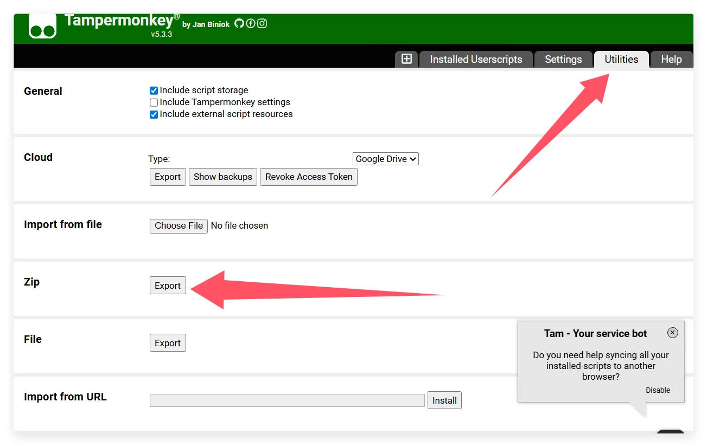

Եթե ներկայումս օգտագործում եք Tampermonkey և ցանկանում եք միգրացիա կատարել ScriptCat-ին, ահա որոշ քայլեր և խորհուրդներ՝ միգրացիան սահուն ավարտելու համար:

## Կրկնօրինակի արտահանում Tampermonkey-ից

Նախ սեղմեք Tampermonkey պատկերակը՝ կառավարման վահանակ մտնելու համար

Սեղմեք `Կոմունալ ծառայություններ`, այնուհետև սեղմեք `Արտահանել` zip ֆայլի բաժնում՝ zip ֆայլը արտահանելու համար

## Ներմուծում ScriptCat

ScriptCat ընդլայնման մեջ սեղմեք կառավարման վահանակի պատկերակը՝ կառավարման վահանակ մտնելու համար

Ընտրեք `Գործիքներ`, այնուհետև սեղմեք `Ներմուծել ֆայլ`, ընտրեք նախկինում արտահանված Tampermonkey zip ֆայլը և սեղմեք `Բացել`՝ ներմուծելու համար:

Այնուհետև նոր բացված էջում ընտրեք կամ ընտրեք բոլոր այն սկրիպտները, որոնք ցանկանում եք ներմուծել, և սեղմեք `Ներմուծել` կոճակը:
