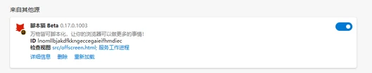

ScriptCat-ը զննարկչի ընդլայնում է, որը կարող է կատարել օգտագործողի սկրիպտներ, համատեղելի է Tampermonkey սկրիպտների հետ և տրամադրում է ավելի շատ հնարավորություններ: Եթե սխալներ գտնեք կամ առաջարկներ ունեք, կարող եք այցելել [GitHub Repo](https://github.com/scriptscat/scriptcat)՝ հետադարձ կապ տրամադրելու համար:

## Տեղադրել ընդլայնումը

Դուք կարող եք տեղադրել ընդլայնումը հետևյալ ընդլայնումների խանութներից՝

| Զննարկիչ         | Խանութի հղում                                                                                                                                                                                                                                     | Կարգավիճակ         |
| --------------- | ---------------------------------------------------------------------------------------------------------------------------------------------------------------------------------------------------------------------------------------------- | -------------- |
| Chrome          | [Կայուն տարբերակ](https://chrome.google.com/webstore/detail/scriptcat/ndcooeababalnlpkfedmmbbbgkljhpjf) [Բետա տարբերակ](https://chromewebstore.google.com/detail/%E8%84%9A%E6%9C%AC%E7%8C%AB-beta/jaehimmlecjmebpekkipmpmbpfhdacom?authuser=0&hl=zh-CN) | ✅ Հասանելի    |
| Edge            | [Կայուն տարբերակ](https://microsoftedge.microsoft.com/addons/detail/scriptcat/liilgpjgabokdklappibcjfablkpcekh) [Բետա տարբերակ](https://microsoftedge.microsoft.com/addons/detail/scriptcat-beta/nimmbghgpcjmeniofmpdfkofcedcjpfi)                      | ✅ Հասանելի    |
| Firefox         | [Կայուն տարբերակ](https://addons.mozilla.org/zh-CN/firefox/addon/scriptcat/) [Բետա տարբերակ](https://addons.mozilla.org/zh-CN/firefox/addon/scriptcat-pre/)                                                                                             | ✅ MV2         |

### Այլ զննարկիչներ

Եթե ձեր զննարկիչը վերը նշված ցուցակում չէ, կարող եք ներբեռնել `zip`/`crx` ֆայլը [Github Release](https://github.com/scriptscat/scriptcat/releases) էջից և տեղադրել այն ձեռքով:

### Անփաթեթ ընդլայնման տեղադրում {#load-unpacked-extension-installation}

① Նախ ներբեռնեք `zip` ֆայլը [Github Release](https://github.com/scriptscat/scriptcat/releases) կամ [Համայնքի ներբեռնման](https://bbs.tampermonkey.net.cn/thread-3068-1-1.html) էջից: Եթե դա `crx` ֆայլ է, փոխեք դրա ընդլայնումը `zip`-ի:

② Պատրաստեք թղթապանակ՝ հավելվածը պահելու համար, և արխիվացրեք վերը նշված zip ֆայլը այդ թղթապանակում: Արխիվացումից հետո այն պետք է այսպիսի տեսք ունենա (**Նշում. այս թղթապանակը չի կարելի ջնջել կամ տեղափոխել, հակառակ դեպքում ընդլայնումը ճիշտ չի աշխատի**) 

③ Բացեք զննարկչի ընդլայնումների կառավարման ինտերֆեյսը՝ անփաթեթ ընդլայնումը բեռնելու համար (տեսեք [Միացնել մշակողի ռեժիմը՝ manifest v3 ScriptCat-ին աջակցելու համար](/docs/use/open-dev/)՝ նախ մշակողի ռեժիմը միացնելու համար)

- 1. **Edge** 
- 2. **Chrome** 

④ Ընտրեք ② քայլում ստեղծված թղթապանակը (բեռնման ավարտից հետո ScriptCat պատկերակը կհայտնվի ընդլայնումների ցուցակում՝ ընդլայնումների կառավարման ինտերֆեյսում, և դուք կարող եք այն տեսնել նաև՝ սեղմելով զննարկչի հասցեագոտու վերևի աջ անկյունի ընդլայնումների կոճակը)

- 1. **Edge** 
- 2. **Chrome** 

⑤ Սեղմեք վերևի աջ անկյունի ScriptCat պատկերակը, սեղմեք հայտնվող ինտերֆեյսի վերևի աջ անկյունի `┆` > Ստանալ սկրիպտներ, և կարող եք գնալ սկրիպտ կայք՝ սկրիպտներ որոնելու և տեղադրելու համար:

Նշում. այս կերպ տեղադրված ընդլայնումները չեն կարող ինքնաբերաբար թարմացվել: Եթե անհրաժեշտ է թարմացնել, խնդրում ենք կրկնել վերը նշված քայլերը՝ ընդլայնումը թարմացնելու համար (փոխարինեք ֆայլերը և մեկ անգամ վերաբեռնեք):

## Ստանալ սկրիպտներ

> Սկրիպտներից բացի, կարող եք նաև որոշ սկրիպտ տեղեկություններ և ձեռնարկներ ստանալ [Tampermonkey չինական ֆորումից](https://bbs.tampermonkey.net.cn/) և [Սկրիպտի մշակման ուղեցույցից](https://learn.scriptcat.org/):

### ScriptCat սկրիպտ կայք

[ScriptCat սկրիպտ կայքը](https://scriptcat.org/) այս ընդլայնման սկրիպտ կայքն է, որտեղ կարող եք հրապարակել ձեր գրած սկրիպտները:

- Նոր սկրիպտ կայք
- Ֆոնային սկրիպտներ/պլանավորված սկրիպտներ
- Օգտագործողի համար հարմար ինտերֆեյս

### Userscript.Zone որոնում

[Userscript.Zone որոնումը](https://www.userscript.zone/?utm_source=tm.net&utm_medium=scripts) նոր կայք է, որը թույլ է տալիս որոնել օգտագործողի սկրիպտներ՝ մուտքագրելով համապատասխան URL-ներ կամ դոմեններ:

- Սկրիպտային ռեսուրսների մեծ քանակություն
- Հեշտ է գտնել համապատասխան օգտագործողի սկրիպտներ
- Ցուցադրում է միայն վերանայված օգտագործողի սկրիպտների էջերից կամ առնվազն մեկնաբանությունների ֆունկցիայով էջերից ստացված օգտագործողի սկրիպտներ

### GreasyFork

[GreasyFork](https://greasyfork.org/) լայնորեն օգտագործվող հարթակ է՝ userscript-ներ տեղադրելու և կիսելու համար, որը թույլ է տալիս մշակողներին հրապարակել, իսկ օգտագործողներին՝ տեղադրել զննարկչի վրա հիմնված սկրիպտներ, որոնք ընդլայնում կամ փոփոխում են կայքի ֆունկցիոնալությունը: Կայքը ստեղծվել է Ջեյսոն Բարնաբեի կողմից և հայտնի է անվտանգության և բաց կոդի թափանցիկության վրա իր շեշտադրմամբ՝ առաջարկելով սկրիպտների մեծ հավաքածու՝ զննարկման փորձը բարելավելու համար:

Ջեյսոն Բարնաբեն նաև Stylish զննարկչի ընդլայնման սկզբնական ստեղծողն է: Այնուամենայնիվ, [Stylish](https://userstyles.org/)-ը վաճառվել է 2016 թվականին և այժմ շահագործվում է այլ ընկերության կողմից, առանց Ջեյսոն Բարնաբեի անմիջական մասնակցության դրա հետագա զարգացմանը:

- Սկրիպտային ռեսուրսների մեծ քանակություն
- Ունի Github-ից սկրիպտներ համաժամեցնելու հնարավորություն
- Շատ ակտիվ [բաց կոդի զարգացման մոդել](https://github.com/JasonBarnabe/greasyfork)

### GitHub/Gist

Դուք կարող եք [որոնել սկրիպտային ռեսուրսներ Github-ում և Gist-ում:](https://gist.github.com/search?l=JavaScript&o=desc&q="%3D%3DUserScript%3D%3D"&s=updated)

## Ներածական շրջագայություն

ScriptCat տեղադրելուց հետո կառավարման վահանակը բացելը ավտոմատ կերպով կսկսի ներածական շրջագայությունը (կարող եք նաև այն կրկին բացել ցանկացած պահի ձախ կողմի վահանակի «Օգնության կենտրոնից»): Շրջագայությունը ներառում է՝

- [Տեղադրել սկրիպտներ](/docs/use/script_installation/). տեղադրում սկրիպտ շուկաներից, ներառյալ [ֆոնային սկրիպտների](/docs/dev/background/) աջակցությունը:
- Կառավարում և գործարկում. խմբագրում, գործարկում/կանգառում, [UserConfig](/docs/dev/config/):
- [Կրկնօրինակում](/docs/use/sync/) և [միգրացիա այլ կառավարիչներից](/docs/use/from-other/migrate-from-tampermonkey/):
- [Սկրիպտի համաժամացում](/docs/use/sync/):
- [Բաժանորդագրություններ](/docs/dev/subscribe/):
