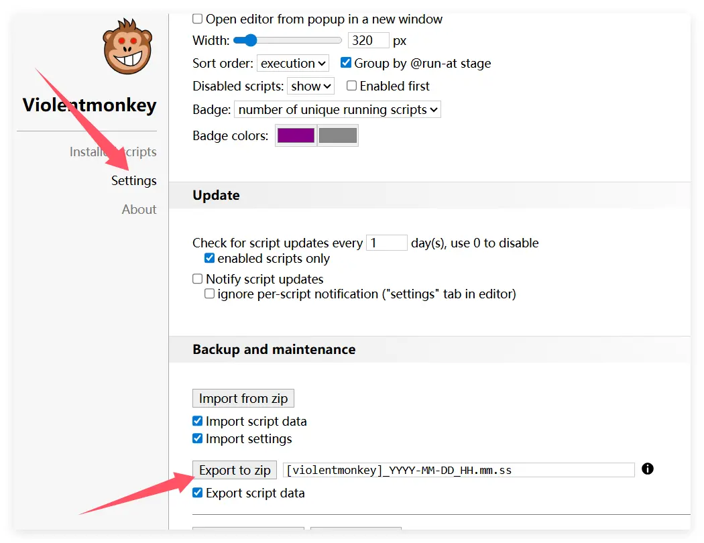

Jika Anda saat ini menggunakan Violentmonkey dan ingin migrasi ke Scriptcat, berikut adalah langkah-langkah dan tips untuk membantu Anda menyelesaikan migrasi dengan lancar.

## Ekspor Cadangan dari Violentmonkey

Pertama, klik ikon Violentmonkey untuk masuk ke panel pengelolaan

Klik `Pengaturan`, lalu klik `Ekspor sebagai file zip` untuk mengekspor file cadangan

## Impor ke Scriptcat

Di ekstensi Scriptcat, klik ikon dasbor untuk masuk ke panel pengelolaan

Pilih `Alat`, lalu klik `Impor File`, pilih file zip Violentmonkey yang diekspor sebelumnya, dan klik `Buka` untuk mengimpor.

Kemudian di halaman yang baru dibuka, pilih atau pilih semua skrip yang ingin Anda impor, dan klik tombol `Impor`.
