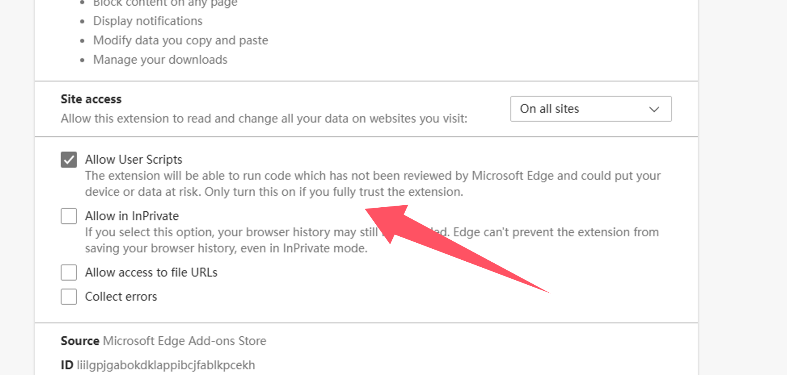

import Tabs from '@theme/Tabs';
import TabItem from '@theme/TabItem';
import { Icon } from "@iconify/react";
import BrowserGuide from '@site/src/components/BrowserGuide';
import GithubStar from '@site/src/components/GithubStar';

<GithubStar variant="bar" scene="install" />

<BrowserGuide texts={{
  allowUserScripts: {
    title: "Browser Anda mendukung 'Izinkan Skrip Pengguna'",
    description: "Ikuti langkah-langkah di bawah untuk mengaktifkan opsi 'Izinkan Skrip Pengguna' agar ScriptCat dapat digunakan dengan normal.",
    button: "Lihat langkah-langkah",
    anchor: "#allow-user-scripts",
  },
  devMode: {
    title: "Browser Anda memerlukan 'Mode Pengembang' diaktifkan",
    description: "Ikuti langkah-langkah di bawah untuk mengaktifkan 'Mode Pengembang' agar ScriptCat dapat digunakan dengan normal.",
    button: "Lihat langkah-langkah",
    anchor: "#enable-developer-mode",
  },
  legacy: {
    title: "Versi browser Anda terlalu lama",
    description: "Browser Anda tidak mendukung Manifest V3. Anda perlu memasang secara manual ScriptCat lama (v0.16.x). Lihat petunjuk di bawah.",
  },
  nonChromium: {
    title: "Browser berbasis Chromium tidak terdeteksi",
    description: "ScriptCat saat ini hanya mendukung browser berbasis Chromium (seperti Chrome, Edge, dll.). Jika Anda menggunakan browser berbasis Chromium, abaikan pesan ini dan ikuti langkah-langkah di bawah.",
  },
}} />

## Izinkan Skrip Pengguna {#allow-user-scripts}

[Izinkan Skrip Pengguna](https://developer.chrome.com/docs/extensions/reference/api/userScripts?hl=en#chrome_versions_138_and_newer_allow_user_scripts_toggle) adalah fitur baru Manifest V3 yang memungkinkan skrip pengguna berjalan di browser.

<Tabs groupId="browser" queryString>
  <TabItem value="edge" label={
<Icon height={16} width={16} icon="logos:microsoft-edge" />Edge
} default>

① Buka antarmuka pengelolaan ekstensi browser, atau kunjungi [edge://extensions/](edge://extensions/)

② Di antarmuka pengelolaan ekstensi, temukan ekstensi ScriptCat dan klik `Detail`

③ Di halaman detail ekstensi ScriptCat, temukan opsi `Izinkan skrip pengguna` dan aktifkan. Kemudian nonaktifkan dan aktifkan kembali ekstensi, atau mulai ulang browser agar fungsionalitas skrip berfungsi.

> ⚠️⚠️⚠️ Untuk browser Edge versi rendah (\<=143) atau pengguna tanpa opsi ini, silakan lihat [Aktifkan Mode Pengembang](#enable-developer-mode)

  </TabItem>
  <TabItem value="chrome" label={
<Icon height={16} width={16} icon="logos:chrome" />Chrome
}>

① Buka antarmuka pengelolaan ekstensi browser, atau kunjungi [chrome://extensions/](chrome://extensions/)

② Di antarmuka pengelolaan ekstensi, temukan ekstensi ScriptCat dan klik `Detail`

③ Di halaman detail ekstensi ScriptCat, temukan opsi `Izinkan skrip pengguna` dan aktifkan. Kemudian nonaktifkan dan aktifkan kembali ekstensi, atau mulai ulang browser agar fungsionalitas skrip berfungsi.

</TabItem>
  <TabItem value="edge-mobile" label={
<Icon height={16} width={16} icon="logos:microsoft-edge" />Edge Mobile
}>

Untuk Edge Mobile dengan versi mesin browser ≥ 138, Mode Pengembang tidak diperlukan. Aktifkan `Izinkan skrip pengguna` di pengaturan ekstensi sebagai gantinya.

① Buka daftar ekstensi Edge Mobile, temukan ekstensi ScriptCat, dan ketuk tombol `⋮` di sebelah kanan

② Di popup pengaturan ekstensi, aktifkan `Izinkan skrip pengguna`

③ Nonaktifkan dan aktifkan kembali ekstensi, atau mulai ulang browser agar fungsionalitas skrip berfungsi.

> ⚠️⚠️⚠️ Untuk versi mesin browser yang lebih rendah dari 138, atau pengguna tanpa opsi ini, silakan lihat [Aktifkan Mode Pengembang](#enable-developer-mode)

  </TabItem>
</Tabs>

## Aktifkan Mode Pengembang {#enable-developer-mode}

<Tabs groupId="browser" queryString>
  <TabItem value="edge" label={
<Icon height={16} width={16} icon="logos:microsoft-edge" />Edge
} default>

① Buka antarmuka pengelolaan ekstensi browser, atau kunjungi [edge://extensions/](edge://extensions/)

② Aktifkan `Mode pengembang` (Di beberapa browser, mode ini mungkin terletak di opsi lain, seperti Browser 360: Manajemen Lanjutan > Mode Pengembang)

③ Setelah mengaktifkan mode pengembang, nonaktifkan lalu aktifkan kembali ekstensi, atau mulai ulang browser agar fungsionalitas skrip berfungsi.

  </TabItem>
  <TabItem value="chrome" label={
<Icon height={16} width={16} icon="logos:chrome" />Chrome
}>

① Buka antarmuka pengelolaan ekstensi browser, atau kunjungi [chrome://extensions/](chrome://extensions/)

② Aktifkan `Mode pengembang` (Di beberapa browser, mode ini mungkin terletak di opsi lain, seperti Browser 360: Manajemen Lanjutan > Mode Pengembang)

③ Setelah mengaktifkan mode pengembang, nonaktifkan lalu aktifkan kembali ekstensi, atau mulai ulang browser agar fungsionalitas skrip berfungsi.

  </TabItem>

<TabItem value="edge-mobile" label={
<Icon height={16} width={16} icon="logos:microsoft-edge" />Edge Mobile
}>

Untuk Edge Mobile dengan versi mesin browser lebih rendah dari 138, atau tanpa opsi `Izinkan skrip pengguna`, ketuk tombol pengaturan di bagian atas halaman ekstensi untuk mengaktifkan Mode Pengembang.

</TabItem>

</Tabs>

:::warning Pemberitahuan Versi Lama

Jika Anda menggunakan sistem Windows 8/7/XP, atau versi mesin browser Anda lebih rendah dari 120, Anda perlu memasang secara manual [ScriptCat lama](https://bbs.tampermonkey.net.cn/thread-3068-1-1.html). v0.16.x adalah versi terakhir yang mendukung Manifest V2. Langkah pemasangan dapat ditemukan di: [Pemasangan ekstensi dengan muat unpacked](/docs/use/use/#load-unpacked-extension-installation).

:::

Latar Belakang Teknis: Manifest V3

Karena pembatasan browser, ekstensi dipaksa untuk ditingkatkan ke Manifest V3, dan ekstensi Manifest V2 akan dihentikan sepenuhnya setelah Juni 2025. Di bawah keterbatasan Manifest V3, Anda harus mengaktifkan mode pengembang atau fungsionalitas skrip pengguna untuk menggunakan ekstensi ScriptCat secara normal.

Referensi: [Mode pengembang untuk pengguna ekstensi](https://developer.chrome.com/docs/extensions/reference/api/userScripts?hl=en#developer_mode_for_extension_users), [Manifest V3](https://developer.chrome.com/docs/extensions/develop/migrate/what-is-mv3?hl=en)

Untuk versi mesin browser ≥ 138, Anda perlu mengaktifkan "Izinkan Skrip Pengguna". Untuk versi yang lebih rendah, gunakan "Aktifkan Mode Pengembang".

