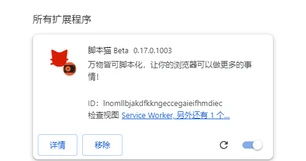

ScriptCat은 사용자 스크립트를 실행할 수 있는 브라우저 확장 프로그램으로, Tampermonkey 스크립트와 호환되며 더 많은 기능을 제공합니다. 버그를 발견하거나 제안이 있으면 [GitHub 리포지토리](https://github.com/scriptscat/scriptcat)를 방문하여 피드백할 수 있습니다.

## 확장 프로그램 설치

다음 확장 프로그램 스토어에서 확장 프로그램을 설치할 수 있습니다:

| 브라우저         | 스토어 링크                                                                                                                                                                                                                                     | 상태         |
| --------------- | ---------------------------------------------------------------------------------------------------------------------------------------------------------------------------------------------------------------------------------------------- | -------------- |
| Chrome          | [안정 버전](https://chrome.google.com/webstore/detail/scriptcat/ndcooeababalnlpkfedmmbbbgkljhpjf) [베타 버전](https://chromewebstore.google.com/detail/%E8%84%9A%E6%9C%AC%E7%8C%AB-beta/jaehimmlecjmebpekkipmpmbpfhdacom?authuser=0&hl=zh-CN) | ✅ 사용 가능    |
| Edge            | [안정 버전](https://microsoftedge.microsoft.com/addons/detail/scriptcat/liilgpjgabokdklappibcjfablkpcekh) [베타 버전](https://microsoftedge.microsoft.com/addons/detail/scriptcat-beta/nimmbghgpcjmeniofmpdfkofcedcjpfi)                      | ✅ 사용 가능    |
| Firefox         | [안정 버전](https://addons.mozilla.org/zh-CN/firefox/addon/scriptcat/) [베타 버전](https://addons.mozilla.org/zh-CN/firefox/addon/scriptcat-pre/)                                                                                             | ✅ MV2         |

### 기타 브라우저

브라우저가 위 목록에 없으면 [Github 릴리스](https://github.com/scriptscat/scriptcat/releases) 페이지에서 `zip`/`crx` 파일을 다운로드하여 수동으로 설치할 수 있습니다.

### 압축 해제된 확장 프로그램 설치 {#load-unpacked-extension-installation}

① 먼저 [Github 릴리스](https://github.com/scriptscat/scriptcat/releases) 또는 [커뮤니티 다운로드](https://bbs.tampermonkey.net.cn/thread-3068-1-1.html) 페이지에서 `zip` 파일을 다운로드합니다. `crx` 파일이면 확장자를 `zip`으로 변경합니다.

② 플러그인을 저장할 폴더를 준비하고 위 zip 파일을 해당 폴더에 압축 해제합니다. 압축 해제 후 다음과 같은 모양이어야 합니다 (**참고: 이 폴더는 삭제하거나 이동할 수 없습니다. 그렇지 않으면 확장 프로그램이 제대로 작동하지 않습니다**) 

③ 브라우저의 확장 프로그램 관리 인터페이스를 열어 압축 해제된 확장 프로그램을 로드합니다 (먼저 [manifest v3 ScriptCat을 지원하도록 개발자 모드 활성화](/docs/use/open-dev/)를 참조하여 개발자 모드를 활성화하세요)

- 1. **Edge** 
- 2. **Chrome** 

④ ②단계에서 만든 폴더를 선택합니다 (로드가 완료되면 확장 프로그램 관리 인터페이스의 확장 프로그램 목록에 ScriptCat 아이콘이 나타나며, 브라우저 주소 표시줄 오른쪽 상단의 확장 프로그램 버튼을 클릭해도 확인할 수 있습니다)

- 1. **Edge** 
- 2. **Chrome** 

⑤ 오른쪽 상단의 ScriptCat 아이콘을 클릭하고 나타나는 인터페이스의 오른쪽 상단에서 `┆` > 스크립트 받기를 클릭하면 스크립트 사이트에서 스크립트를 검색하고 설치할 수 있습니다.

참고: 이렇게 설치된 확장 프로그램은 자동으로 업데이트할 수 없습니다. 업데이트가 필요한 경우 위 단계를 반복하여 확장 프로그램을 업데이트하세요 (파일을 교체하고 한 번 다시 로드).

## 스크립트 받기

> 스크립트 외에도 [Tampermonkey 중국어 포럼](https://bbs.tampermonkey.net.cn/)과 [스크립트 개발 가이드](https://learn.scriptcat.org/)에서 스크립트 정보와 튜토리얼을 얻을 수 있습니다.

### ScriptCat 스크립트 사이트

[ScriptCat 스크립트 사이트](https://scriptcat.org/)는 이 확장 프로그램의 스크립트 사이트로, 작성한 스크립트를 게시할 수 있습니다.

- 새로운 스크립트 사이트
- 백그라운드 스크립트/예약 스크립트
- 사용자 친화적인 인터페이스

### Userscript.Zone 검색

[Userscript.Zone 검색](https://www.userscript.zone/?utm_source=tm.net&utm_medium=scripts)은 적절한 URL이나 도메인을 입력하여 사용자 스크립트를 검색할 수 있는 새로운 웹사이트입니다.

- 많은 스크립트 리소스
- 적합한 사용자 스크립트를 쉽게 찾을 수 있음
- 검토된 사용자 스크립트 페이지 또는 최소한 댓글 기능이 있는 페이지만 표시

### GreasyFork

[GreasyFork](https://greasyfork.org/)는 사용자 스크립트를 호스팅하고 공유하는 널리 사용되는 플랫폼으로, 개발자가 게시하고 사용자가 웹사이트 기능을 향상하거나 수정하는 브라우저 기반 스크립트를 설치할 수 있게 해줍니다. 이 사이트는 Jason Barnabe가 만들었으며 보안과 오픈소스 투명성을 강조하는 것으로 유명하며, 브라우징 경험을 개선하는 많은 스크립트를 제공합니다.

Jason Barnabe는 Stylish 브라우저 확장 프로그램의 원래 제작자이기도 합니다. 그러나 [Stylish](https://userstyles.org/)는 2016년에 매각되어 현재 다른 회사가 운영하고 있으며, 이후 개발에 Jason Barnabe가 직접 관여하지 않았습니다.

- 많은 스크립트 리소스
- Github에서 스크립트를 동기화하는 기능
- 매우 활발한 [오픈소스 개발 모델](https://github.com/JasonBarnabe/greasyfork)

### GitHub/Gist

[Github과 Gist에서 스크립트 리소스를 검색](https://gist.github.com/search?l=JavaScript&o=desc&q="%3D%3DUserScript%3D%3D"&s=updated)할 수 있습니다.

## 온보딩 투어

ScriptCat을 설치한 후 대시보드를 열면 온보딩 투어가 자동으로 시작됩니다 (왼쪽 사이드바의 "도움말 센터"에서 언제든지 다시 열 수 있습니다). 투어에서 다루는 내용:

- [스크립트 설치](/docs/use/script_installation/): 스크립트 마켓플레이스에서 설치, [백그라운드 스크립트](/docs/dev/background/) 지원 포함.
- 관리 및 운영: 편집, 실행/중지, [UserConfig](/docs/dev/config/).
- [백업](/docs/use/sync/) 및 [다른 관리자에서 마이그레이션](/docs/use/from-other/migrate-from-tampermonkey/).
- [스크립트 동기화](/docs/use/sync/).
- [구독](/docs/dev/subscribe/).
