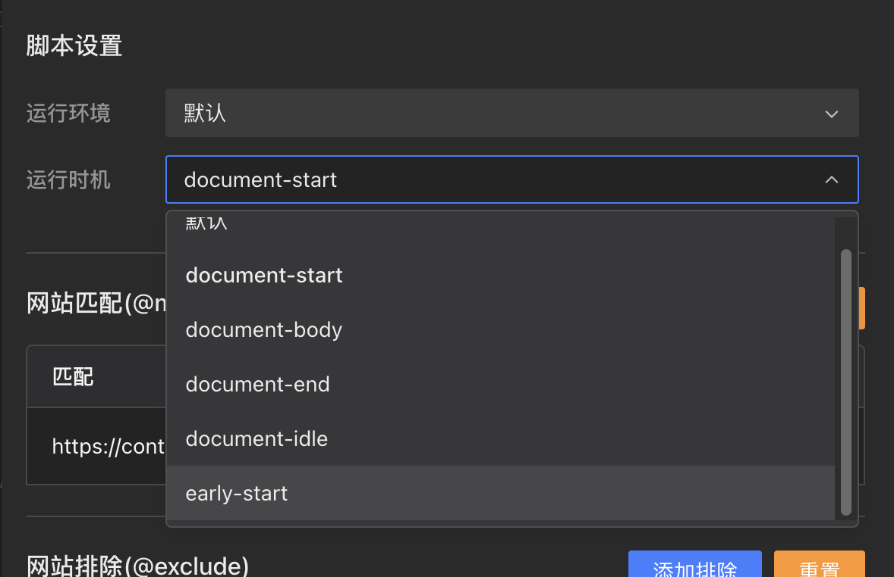

## Новый поток установки скрипта [#842](https://github.com/scriptscat/scriptcat/issues/842)

Переработан поток установки: больше не зависит от редиректов внешнего сайта или новых окон. Скрипты устанавливаются прямо на текущей странице. Макет страницы установки оптимизирован: адаптивный дизайн, прокручиваемый предпросмотр кода и отображение ошибок загрузки на месте.

## Время запуска скрипта [#895](https://github.com/scriptscat/scriptcat/issues/895)

В настройках скрипта можно выбрать момент запуска: `document-start`, `document-body`, `document-end`, `document-idle`, `early-start` и др. — точный контроль над временем выполнения.

## Поддержка Amazon S3 [#1146](https://github.com/scriptscat/scriptcat/issues/1146)

Облачная синхронизация и резервное копирование поддерживают Amazon S3 наряду с WebDAV, Baidu Netdisk, OneDrive, Google Drive и Dropbox.

## Отвязка облачного хранилища [#1151](https://github.com/scriptscat/scriptcat/issues/1151)

В настройках облачной синхронизации добавлена кнопка отвязки — удобно отключать или менять подключение к облаку.
