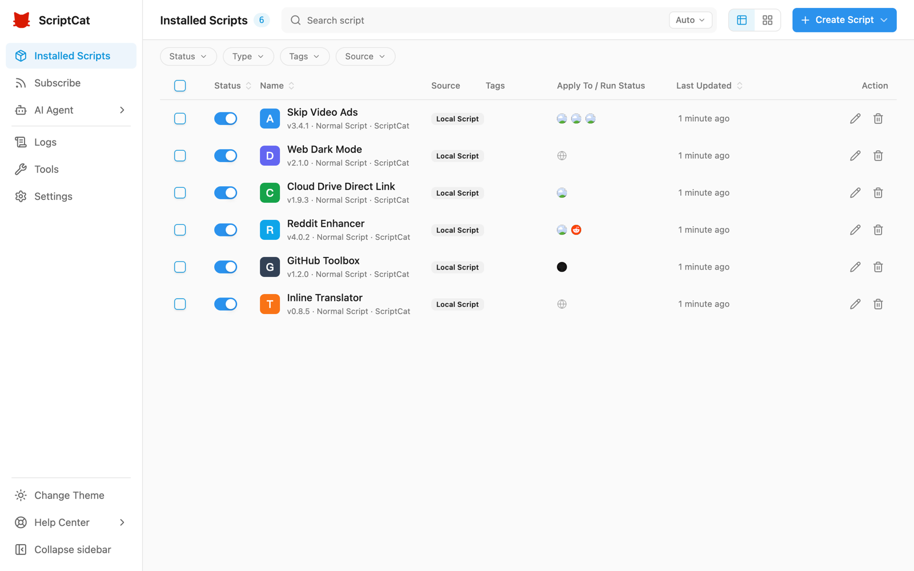

:::caution Тестовая фаза
v1.5 всё ещё в тестировании (Beta); функции могут измениться до официального релиза. Будем рады отзывам — также можно обсудить новый UI/UX в [GitHub Discussions](https://github.com/scriptscat/scriptcat/discussions).
:::

v1.5 — полная перестройка интерфейса ScriptCat: чище, единообразнее и удобнее, с отдельной оптимизацией под мобильные устройства — и на десктопе, и на телефоне опыт лучше.

## Совершенно новый интерфейс [#1514](https://github.com/scriptscat/scriptcat/pull/1514)

Интерфейс полностью пересобран: более единый визуальный стиль, понятная иерархия, полная поддержка светлой и тёмной темы. Список скриптов — таблица и карточки, расширенная фильтрация по статусу, типу, тегу и источнику — удобно управлять большим числом скриптов.

## Оптимизация для мобильных

Макет рассчитан на мобильные браузеры с расширениями (например, Edge for Android и Kiwi): список скриптов карточками, нижняя навигация, боковая панель слева для быстрых Подписок, логов, Инструментов и Настроек; popup расширения адаптируется к узким экранам.

## Выбор типа скрипта из редактора [#1544](https://github.com/scriptscat/scriptcat/pull/1544)

Кнопка «＋» на вкладках редактора сразу предлагает тип создаваемого скрипта (обычный / фоновый / отложенный), без возврата к списку.

## Ручная загрузка локальных бэкапов [#1543](https://github.com/scriptscat/scriptcat/pull/1543)

Для локальных резервных копий появилась ссылка ручной загрузки — экспорт файла бэкапа на устройство.

## structured_clone-сообщения на Chromium 148+ [#1534](https://github.com/scriptscat/scriptcat/pull/1534)

На Chromium 148+ внутренние сообщения расширения используют сериализацию `structured_clone` — поддерживается больше типов данных.

## Прочие улучшения

- **GM API**: нативный `GM_download` учитывает `@connect`, как `GM_xmlhttpRequest` [#1506](https://github.com/scriptscat/scriptcat/pull/1506)
- **Производительность**: улучшен кэш загрузки скриптов, исправлены «залипшие» popup-меню [#1511](https://github.com/scriptscat/scriptcat/pull/1511)
- **Редактор**: скорректированы правила `eslint-plugin-userscripts` [#1510](https://github.com/scriptscat/scriptcat/pull/1510)
- Предрелизы (beta) теперь автоматически открывают страницу changelog
- **Исправление**: проблемы отложенных задач из‑за автоопределения неверной таймзоны cron [#1531](https://github.com/scriptscat/scriptcat/pull/1531)
- **Исправление**: недоступный demo API в примере crontab [#1542](https://github.com/scriptscat/scriptcat/pull/1542)
- **i18n**: добавлен турецкий
