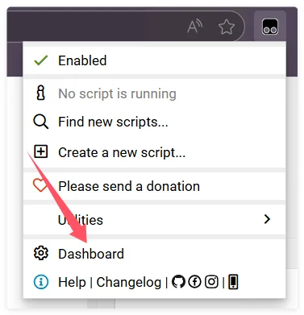
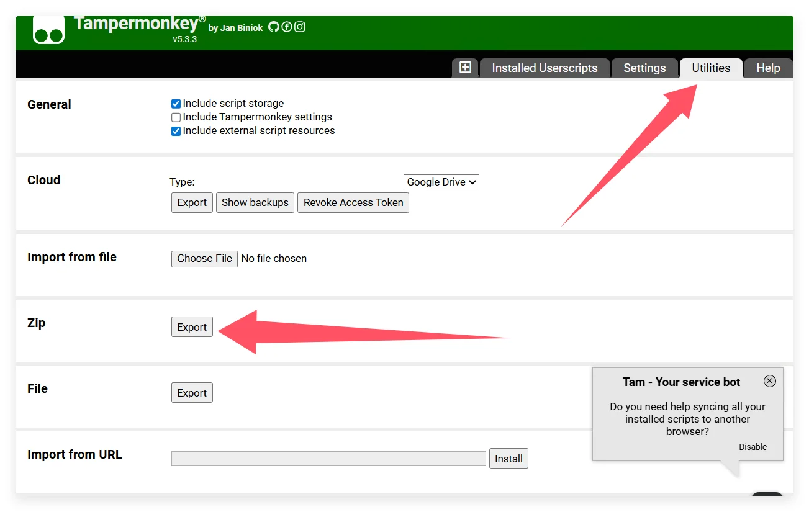
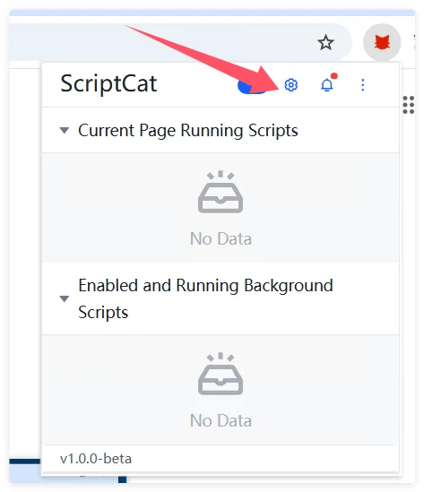
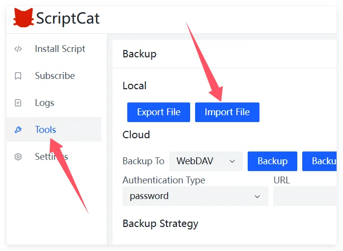

Если вы сейчас используете Tampermonkey и хотите перейти на ScriptCat, ниже приведены шаги и советы, которые помогут выполнить миграцию без проблем.

## Экспорт резервной копии из Tampermonkey

Сначала нажмите значок Tampermonkey, чтобы открыть панель управления.

Нажмите `Utilities`, затем в разделе zip-файла нажмите `Export`, чтобы экспортировать zip-файл.

## Импорт в ScriptCat

В расширении ScriptCat нажмите значок панели управления, чтобы открыть интерфейс управления.

Выберите `Tools`, затем нажмите `Import File`, укажите ранее экспортированный zip-файл Tampermonkey и нажмите `Open` для импорта.

На открывшейся странице выберите нужные скрипты (или выберите все) и нажмите кнопку `Import`.
