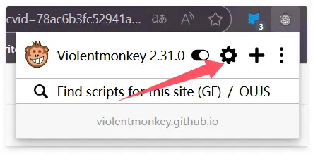
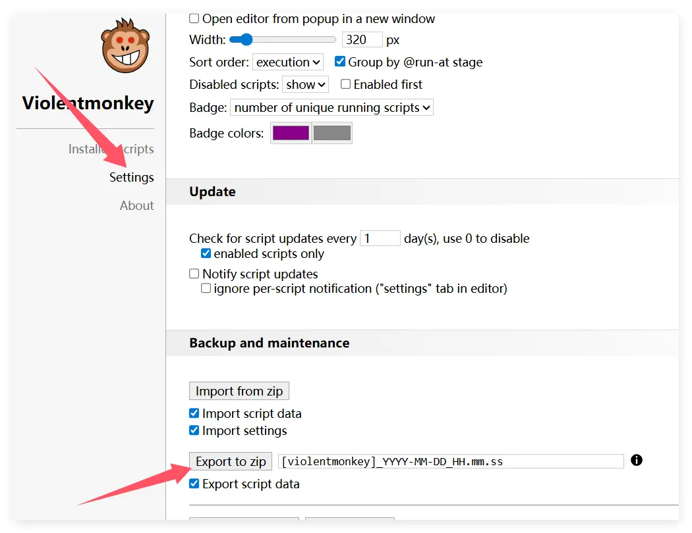

Если вы сейчас используете Violentmonkey и хотите перейти на ScriptCat, ниже приведены шаги и советы, которые помогут выполнить миграцию без проблем.

## Экспорт резервной копии из Violentmonkey

Сначала нажмите значок Violentmonkey, чтобы открыть панель управления.

Нажмите `Settings`, затем нажмите `Export as zip file`, чтобы экспортировать файл резервной копии.

## Импорт в ScriptCat

В расширении ScriptCat нажмите значок панели управления, чтобы открыть интерфейс управления.

Выберите `Tools`, затем нажмите `Import File`, укажите ранее экспортированный zip-файл Violentmonkey и нажмите `Open` для импорта.

На открывшейся странице выберите нужные скрипты (или выберите все) и нажмите кнопку `Import`.
