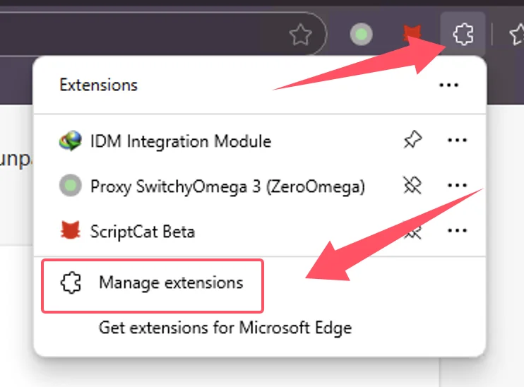
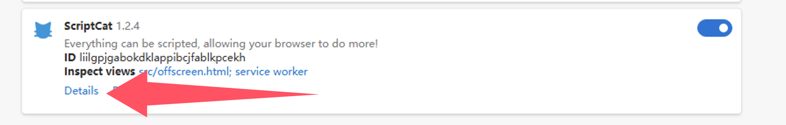
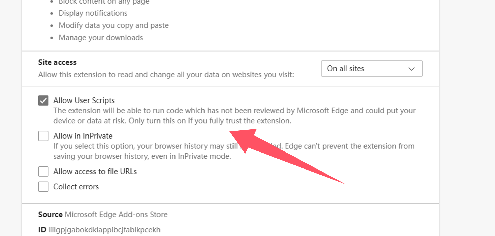
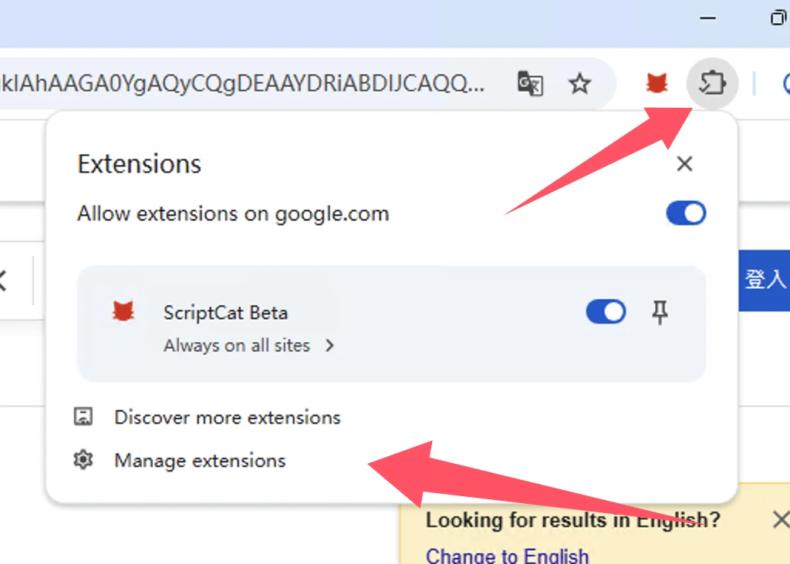
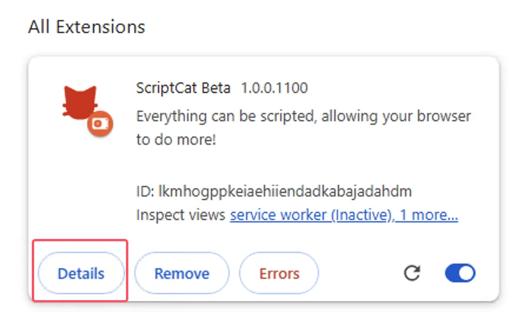
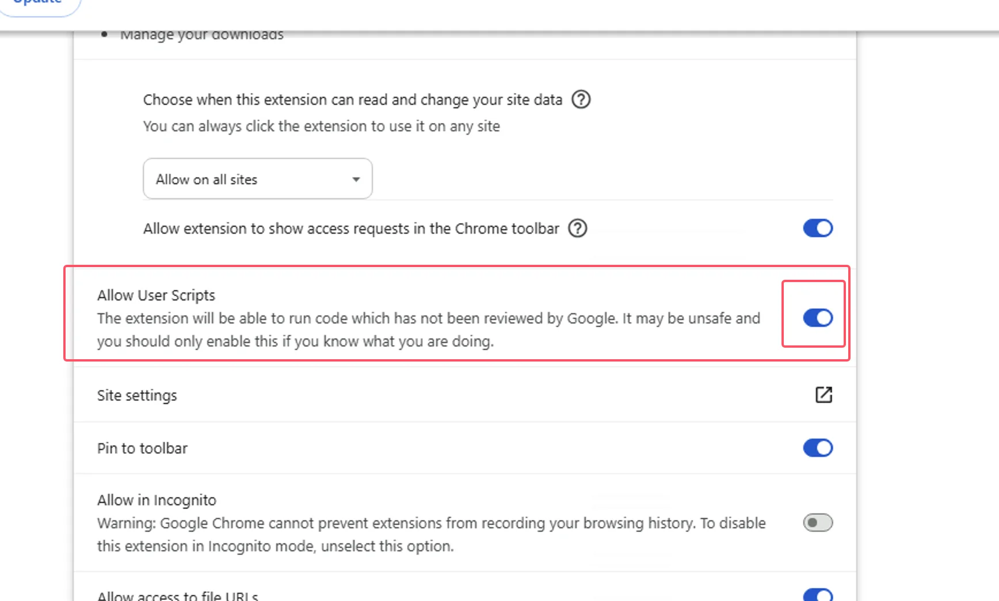
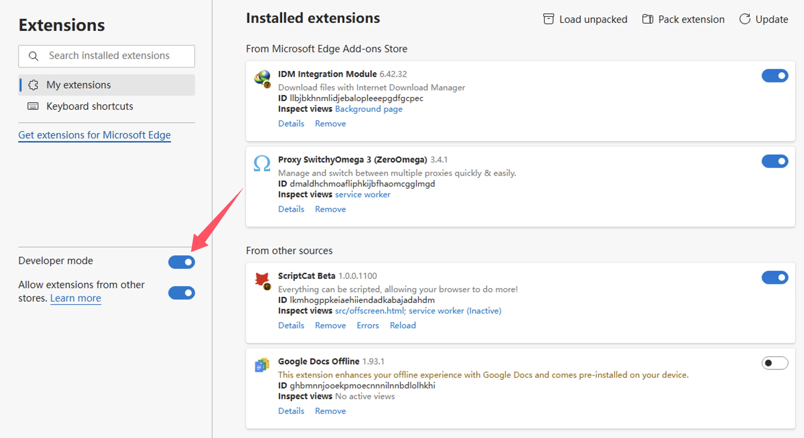
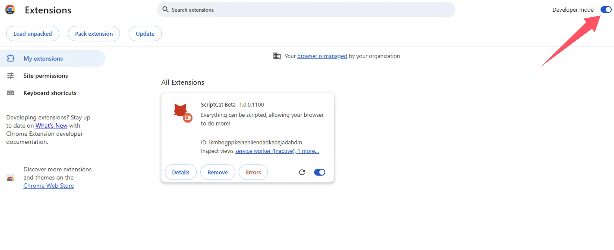

import Tabs from '@theme/Tabs';
import TabItem from '@theme/TabItem';
import { Icon } from "@iconify/react";
import BrowserGuide from '@site/src/components/BrowserGuide';
import GithubStar from '@site/src/components/GithubStar';
import SponsorBlock from '@site/src/components/SponsorBlock/en.mdx';

<GithubStar variant="bar" scene="install" />

<BrowserGuide texts={{
  allowUserScripts: {
    title: "Ваш браузер поддерживает «Разрешить пользовательские скрипты»",
    description: "Следуйте шагам ниже, чтобы включить параметр «Разрешить пользовательские скрипты» и нормально пользоваться ScriptCat.",
    button: "Смотреть шаги",
    anchor: "#allow-user-scripts",
  },
  devMode: {
    title: "В вашем браузере нужно включить «Режим разработчика»",
    description: "Следуйте шагам ниже, чтобы включить «Режим разработчика» и нормально пользоваться ScriptCat.",
    button: "Смотреть шаги",
    anchor: "#enable-developer-mode",
  },
  legacy: {
    title: "Версия браузера слишком старая",
    description: "Ваш браузер не поддерживает Manifest V3. Нужно вручную установить устаревший ScriptCat (v0.16.x). См. инструкции ниже.",
  },
  nonChromium: {
    title: "Chromium-браузер не обнаружен",
    description: "ScriptCat сейчас поддерживает только браузеры на базе Chromium (Chrome, Edge и т.д.). Если вы используете такой браузер, проигнорируйте это сообщение и следуйте шагам ниже.",
  },
}} />

<SponsorBlock />

## Разрешить пользовательские скрипты {#allow-user-scripts}

[Allow User Scripts](https://developer.chrome.com/docs/extensions/reference/api/userScripts?hl=en#chrome_versions_138_and_newer_allow_user_scripts_toggle) — новая возможность Manifest V3, позволяющая запускать пользовательские скрипты в браузере.

<Tabs groupId="browser" queryString>
  <TabItem value="edge" label={
<Icon height={16} width={16} icon="logos:microsoft-edge" />Edge
} default>

① Откройте управление расширениями браузера или перейдите на [edge://extensions/](edge://extensions/)

② Найдите расширение ScriptCat и нажмите `Details` / «Сведения»

③ На странице сведений ScriptCat найдите параметр `Allow user scripts` / «Разрешить пользовательские скрипты» и включите его. Затем отключите и снова включите расширение или перезапустите браузер.

> ⚠️⚠️⚠️ Для более старых Edge (≤143) или если этого параметра нет, см. [Включение режима разработчика](#enable-developer-mode)

  </TabItem>
  <TabItem value="chrome" label={
<Icon height={16} width={16} icon="logos:chrome" />Chrome
}>

① Откройте управление расширениями или перейдите на [chrome://extensions/](chrome://extensions/)

② Найдите расширение ScriptCat и нажмите `Details` / «Сведения»

③ На странице сведений ScriptCat найдите `Allow user scripts` / «Разрешить пользовательские скрипты» и включите. Затем отключите и снова включите расширение или перезапустите браузер.

</TabItem>
  <TabItem value="edge-mobile" label={
<Icon height={16} width={16} icon="logos:microsoft-edge" />Edge Mobile
}>

Для Edge Mobile с версией движка ≥ 138 режим разработчика не обязателен. Включите `Allow user scripts` в настройках расширения.

① Откройте список расширений Edge Mobile, найдите ScriptCat и нажмите `⋮` справа

② Во всплывающих настройках расширения включите `Allow user scripts`

③ Отключите и снова включите расширение или перезапустите браузер.

> ⚠️⚠️⚠️ Для движка ниже 138 или если параметра нет, см. [Включение режима разработчика](#enable-developer-mode)

  </TabItem>
</Tabs>

## Включение режима разработчика {#enable-developer-mode}

<Tabs groupId="browser" queryString>
  <TabItem value="edge" label={
<Icon height={16} width={16} icon="logos:microsoft-edge" />Edge
} default>

① Откройте управление расширениями или [edge://extensions/](edge://extensions/)

② Включите `Developer mode` / «Режим разработчика» (в некоторых браузерах он может быть в другом месте, например 360: Дополнительное управление > Режим разработчика)

③ После включения отключите и снова включите расширение или перезапустите браузер.

  </TabItem>
  <TabItem value="chrome" label={
<Icon height={16} width={16} icon="logos:chrome" />Chrome
}>

① Откройте управление расширениями или [chrome://extensions/](chrome://extensions/)

② Включите `Developer mode` / «Режим разработчика» (в некоторых браузерах он может быть в другом месте)

③ После включения отключите и снова включите расширение или перезапустите браузер.

  </TabItem>

<TabItem value="edge-mobile" label={
<Icon height={16} width={16} icon="logos:microsoft-edge" />Edge Mobile
}>

Для Edge Mobile с движком ниже 138 или без параметра `Allow user scripts` нажмите кнопку настроек вверху страницы расширений и включите режим разработчика.

</TabItem>

</Tabs>

:::warning Устаревшие версии

Если вы используете Windows 8/7/XP или версия движка браузера ниже 120, нужно вручную установить [устаревший ScriptCat](https://bbs.tampermonkey.net.cn/thread-3068-1-1.html). v0.16.x — последняя версия с поддержкой Manifest V2. Шаги установки: [Загрузка распакованного расширения](./use.md#load-unpacked-extension-installation).

:::

Технический фон: Manifest V3

Из‑за ограничений браузеров расширения переводят на Manifest V3, а расширения Manifest V2 полностью отключают после июня 2025. В рамках Manifest V3 для нормальной работы ScriptCat нужно включить режим разработчика или поддержку пользовательских скриптов.

Справка: [Developer mode for extension users](https://developer.chrome.com/docs/extensions/reference/api/userScripts?hl=en#developer_mode_for_extension_users), [Manifest V3](https://developer.chrome.com/docs/extensions/develop/migrate/what-is-mv3?hl=en)

Для движка ≥ 138 включайте «Allow User Scripts». Для более старых версий — «Режим разработчика».

