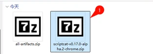
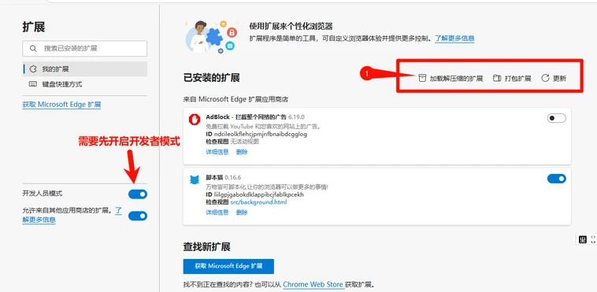
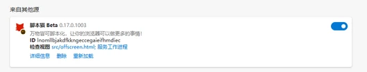
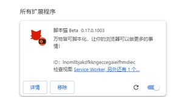

ScriptCat — браузерное расширение для запуска пользовательских скриптов, совместимое со скриптами Tampermonkey и с дополнительными возможностями. Если вы нашли ошибку или хотите предложить улучшение, оставьте отзыв в [репозитории GitHub](https://github.com/scriptscat/scriptcat).

## Установка расширения

Установить расширение можно из следующих магазинов:

| Браузер         | Ссылка                                                                                                                                                                                                                                     | Статус         |
| --------------- | ---------------------------------------------------------------------------------------------------------------------------------------------------------------------------------------------------------------------------------------------- | -------------- |
| Chrome          | [Стабильная версия](https://chrome.google.com/webstore/detail/scriptcat/ndcooeababalnlpkfedmmbbbgkljhpjf) [Бета](https://chromewebstore.google.com/detail/%E8%84%9A%E6%9C%AC%E7%8C%AB-beta/jaehimmlecjmebpekkipmpmbpfhdacom?authuser=0&hl=zh-CN) | ✅ Доступно    |
| Edge            | [Стабильная версия](https://microsoftedge.microsoft.com/addons/detail/scriptcat/liilgpjgabokdklappibcjfablkpcekh) [Бета](https://microsoftedge.microsoft.com/addons/detail/scriptcat-beta/nimmbghgpcjmeniofmpdfkofcedcjpfi)                      | ✅ Доступно    |
| Firefox         | [Стабильная версия](https://addons.mozilla.org/zh-CN/firefox/addon/scriptcat/) [Бета](https://addons.mozilla.org/zh-CN/firefox/addon/scriptcat-pre/)                                                                                             | ✅ MV2         |

### Другие браузеры

Если вашего браузера нет в списке, скачайте файл `zip`/`crx` со страницы [Github Release](https://github.com/scriptscat/scriptcat/releases) и установите вручную.

### Установка через загрузку распакованного расширения {#load-unpacked-extension-installation}

① Скачайте файл `zip` со страницы [Github Release](https://github.com/scriptscat/scriptcat/releases) или [Community Download](https://bbs.tampermonkey.net.cn/thread-3068-1-1.html). Если это файл `crx`, переименуйте расширение в `zip`.

② Подготовьте папку для хранения плагина и распакуйте zip в эту папку. После распаковки должно получиться примерно так (**важно: эту папку нельзя удалять или перемещать, иначе расширение перестанет работать**) 

③ Откройте страницу управления расширениями браузера и загрузите распакованное расширение (сначала включите режим разработчика — см. [Включение поддержки пользовательских скриптов](/docs/use/open-dev/))

- 1. **Edge** 
- 2. **Chrome** 

④ Выберите папку, созданную на шаге ② (после загрузки в списке расширений появится значок ScriptCat; его также можно увидеть, нажав кнопку расширений справа от адресной строки)

- 1. **Edge** 
- 2. **Chrome** 

⑤ Нажмите значок ScriptCat в правом верхнем углу, затем `┆` > «Получить скрипты» — откроется сайт скриптов, где можно искать и устанавливать скрипты.

Примечание: расширения, установленные таким способом, не обновляются автоматически. Для обновления повторите шаги выше (замените файлы и перезагрузите расширение).

## Где взять скрипты

> Помимо скриптов, полезную информацию и руководства можно найти на [китайском форуме Tampermonkey](https://bbs.tampermonkey.net.cn/) и в [гайде по разработке скриптов](https://learn.scriptcat.org/).

### Сайт скриптов ScriptCat

[Сайт скриптов ScriptCat](https://scriptcat.org/) — официальный сайт расширения, где можно публиковать свои скрипты.

- Новый сайт скриптов
- Фоновые скрипты / скрипты по расписанию
- Удобный интерфейс

### Поиск Userscript.Zone

[Userscript.Zone Search](https://www.userscript.zone/?utm_source=tm.net&utm_medium=scripts) — сайт, где можно искать пользовательские скрипты по URL или домену.

- Большой объём скриптов
- Легко найти подходящий скрипт
- Показываются только скрипты с проверенных страниц или страниц с комментариями

### GreasyFork

[GreasyFork](https://greasyfork.org/) — популярная платформа для размещения и обмена userscripts: разработчики публикуют, пользователи устанавливают скрипты, улучшающие или изменяющие сайты. Создан Jason Barnabe, известен акцентом на безопасность и открытость, большая коллекция скриптов.

Jason Barnabe также создал расширение Stylish. Однако [Stylish](https://userstyles.org/) был продан в 2016 году и сейчас развивается другой компанией; Jason Barnabe к дальнейшей разработке не причастен.

- Большой объём скриптов
- Синхронизация скриптов с Github
- Активная [модель open source](https://github.com/JasonBarnabe/greasyfork)

### GitHub/Gist

Можно [искать скрипты на Github и Gist.](https://gist.github.com/search?l=JavaScript&o=desc&q="%3D%3DUserScript%3D%3D"&s=updated)

## Обзор для новичков

После установки ScriptCat при открытии панели управления автоматически запускается ознакомительный тур (его можно снова открыть в «Центре помощи» в левой боковой панели). Тур охватывает:

- [Установку скриптов](/docs/use/script_installation/): из магазинов скриптов, включая [фоновые скрипты](/docs/dev/background/).
- Управление: редактирование, запуск/остановка, [UserConfig](/docs/dev/config/).
- [Резервное копирование](/docs/use/sync/) и [миграцию из других менеджеров](/docs/use/from-other/migrate-from-tampermonkey/).
- [Синхронизацию скриптов](/docs/use/sync/).
- [Подписки](/docs/dev/subscribe/).
