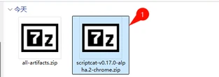

ScriptCat, kullanıcı komut dosyalarını çalıştırabilen, Tampermonkey komut dosyalarıyla uyumlu ve daha fazla özellik sunan bir tarayıcı uzantısıdır. Herhangi bir hata bulursanız veya önerileriniz varsa, geri bildirim sağlamak için [GitHub Deposunu](https://github.com/scriptscat/scriptcat) ziyaret edebilirsiniz.

## Uzantıyı Kurun

Uzantıyı aşağıdaki uzantı mağazalarından kurabilirsiniz:

| Tarayıcı         | Mağaza Bağlantısı                                                                                                                                                                                                                                     | Durum         |
| --------------- | ---------------------------------------------------------------------------------------------------------------------------------------------------------------------------------------------------------------------------------------------- | -------------- |
| Chrome          | [Kararlı Sürüm](https://chrome.google.com/webstore/detail/scriptcat/ndcooeababalnlpkfedmmbbbgkljhpjf) [Beta Sürümü](https://chromewebstore.google.com/detail/%E8%84%9A%E6%9C%AC%E7%8C%AB-beta/jaehimmlecjmebpekkipmpmbpfhdacom?authuser=0&hl=zh-CN) | ✅ Mevcut    |
| Edge            | [Kararlı Sürüm](https://microsoftedge.microsoft.com/addons/detail/scriptcat/liilgpjgabokdklappibcjfablkpcekh) [Beta Sürümü](https://microsoftedge.microsoft.com/addons/detail/scriptcat-beta/nimmbghgpcjmeniofmpdfkofcedcjpfi)                      | ✅ Mevcut    |
| Firefox         | [Kararlı Sürüm](https://addons.mozilla.org/zh-CN/firefox/addon/scriptcat/) [Beta Sürümü](https://addons.mozilla.org/zh-CN/firefox/addon/scriptcat-pre/)                                                                                             | ✅ MV2         |

### Diğer Tarayıcılar

Tarayıcınız yukarıdaki listede yoksa, [Github Sürüm](https://github.com/scriptscat/scriptcat/releases) sayfasından `zip`/`crx` dosyasını indirebilir ve manuel olarak kurabilirsiniz.

### Yüklenmemiş Uzantı Kurulumu {#load-unpacked-extension-installation}

① Önce [Github Sürüm](https://github.com/scriptscat/scriptcat/releases) veya [Topluluk İndirme](https://bbs.tampermonkey.net.cn/thread-3068-1-1.html) sayfasından `zip` dosyasını indirin. `crx` dosyasıysa, uzantısını `zip` olarak değiştirin.

② Eklentiyi saklamak için bir klasör hazırlayın ve yukarıdaki zip dosyasını bu klasöre çıkarın. Çıkardıktan sonra şu şekilde görünmelidir (**Not: Bu klasör silinemez veya taşınamaz, aksi takdirde uzantı düzgün çalışmaz**) 

③ Yüklenmemiş uzantıyı yüklemek için tarayıcının uzantı yönetimi arayüzünü açın (önce geliştirici modunu etkinleştirmek için [manifest v3 ScriptCat'i desteklemek üzere geliştirici modunu etkinleştirme](/docs/use/open-dev/) bölümüne bakın)

- 1. **Edge** 
- 2. **Chrome** 

④ ② adımında oluşturulan klasörü seçin (yükleme tamamlandıktan sonra, ScriptCat simgesi uzantı yönetimi arayüzündeki uzantı listesinde görünecektir; tarayıcının adres çubuğunun sağ üst köşesindeki uzantı düğmesine tıklayarak da görebilirsiniz)

- 1. **Edge** 
- 2. **Chrome** 

⑤ Sağ üst köşedeki ScriptCat simgesine tıklayın, görünen arayüzün sağ üst köşesindeki `┆` > Komut Dosyalarını Al'a tıklayın; komut dosyalarını aramak ve kurmak için komut dosyası sitesine gidebilirsiniz.

Not: Bu şekilde kurulan uzantılar otomatik güncellenemez. Güncellemeniz gerekiyorsa, uzantıyı güncellemek için yukarıdaki adımları tekrarlayın (dosyaları değiştirin ve bir kez yeniden yükleyin).

## Komut Dosyalarını Alın

> Komut dosyalarının yanı sıra, [Tampermonkey Çin Forumu](https://bbs.tampermonkey.net.cn/) ve [Komut Dosyası Geliştirme Rehberinden](https://learn.scriptcat.org/) bazı komut dosyası bilgileri ve eğitimleri de alabilirsiniz.

### ScriptCat Komut Dosyası Sitesi

[ScriptCat Komut Dosyası Sitesi](https://scriptcat.org/), bu uzantının komut dosyası sitesidir; burada yazdığınız komut dosyalarını yayınlayabilirsiniz.

- Yeni komut dosyası sitesi
- Arka plan komut dosyaları/zamanlanmış komut dosyaları
- Kullanıcı dostu arayüz

### Userscript.Zone Arama

[Userscript.Zone Arama](https://www.userscript.zone/?utm_source=tm.net&utm_medium=scripts), uygun URL veya alan adları girerek kullanıcı komut dosyalarını aramaya olanak tanıyan yeni bir web sitesidir.

- Çok sayıda komut dosyası kaynağı
- Uygun kullanıcı komut dosyalarını bulmak kolay
- Yalnızca incelenmiş kullanıcı komut dosyası sayfalarından veya en azından yorum işlevi olan sayfalardan kullanıcı komut dosyalarını gösterir

### GreasyFork

[GreasyFork](https://greasyfork.org/), userscript'leri barındırmak ve paylaşmak için yaygın olarak kullanılan, geliştiricilerin web sitesi işlevlerini geliştiren veya değiştiren tarayıcı tabanlı komut dosyalarını yayınlamasına ve kullanıcıların kurmasına olanak tanıyan bir platformdur. Site Jason Barnabe tarafından oluşturulmuştur ve güvenlik ile açık kaynak şeffaflığına verdiği önemle bilinir; gezinme deneyimini iyileştirmek için geniş bir komut dosyası koleksiyonu sunar.

Jason Barnabe ayrıca Stylish tarayıcı uzantısının orijinal yaratıcısıdır. Ancak [Stylish](https://userstyles.org/) 2016 yılında satıldı ve artık farklı bir şirket tarafından işletilmektedir; Jason Barnabe'nin sonraki geliştirmelerinde doğrudan bir katkısı yoktur.

- Çok sayıda komut dosyası kaynağı
- Komut dosyalarını Github'dan senkronize etme yeteneğine sahiptir
- Çok aktif [açık kaynak geliştirme modeli](https://github.com/JasonBarnabe/greasyfork)

### GitHub/Gist

[Github ve Gist'te komut dosyası kaynaklarını arayabilirsiniz.](https://gist.github.com/search?l=JavaScript&o=desc&q="%3D%3DUserScript%3D%3D"&s=updated)

## Tanıtım Turu

ScriptCat'i kurduktan sonra, paneli açmak tanıtım turunu otomatik olarak başlatır (sol kenar çubuğundaki "Yardım Merkezi"nden istediğiniz zaman yeniden açabilirsiniz). Tur şunları kapsar:

- [Komut dosyalarını kur](/docs/use/script_installation/): komut dosyası pazarlarından kurulum, [arka plan komut dosyaları](/docs/dev/background/) desteği dahil.
- Yönet ve çalıştır: düzenleme, çalıştırma/durdurma, [UserConfig](/docs/dev/config/).
- [Yedekleme](/docs/use/sync/) ve [diğer yöneticilerden geçiş](/docs/use/from-other/migrate-from-tampermonkey/).
- [Komut dosyası senkronizasyonu](/docs/use/sync/).
- [Abonelikler](/docs/dev/subscribe/).
