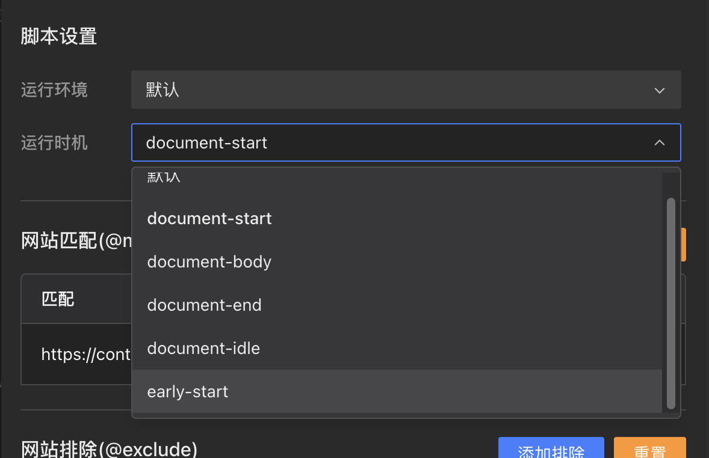

## Новий процес встановлення скриптів [#842](https://github.com/scriptscat/scriptcat/issues/842)

Процес встановлення скриптів перероблено — більше не покладається на перенаправлення на зовнішні сайти чи відкриття нових вікон. Скрипти тепер встановлюються безпосередньо на поточній сторінці. Макет сторінки встановлення також оптимізовано: адаптивний дизайн, прокручуваний попередній перегляд коду та вбудоване відображення помилок при невдалому завантаженні.

## Параметри часу запуску скрипта [#895](https://github.com/scriptscat/scriptcat/issues/895)

Додано параметр часу запуску в налаштуваннях скрипта, який дозволяє вибрати між `document-start`, `document-body`, `document-end`, `document-idle`, `early-start` та іншими, що дає точний контроль над тим, коли виконується ваш скрипт.

## Підтримка сховища Amazon S3 [#1146](https://github.com/scriptscat/scriptcat/issues/1146)

Хмарна синхронізація та резервне копіювання тепер підтримують Amazon S3 як бекенд сховища, на додаток до наявних варіантів, як-от WebDAV, Baidu Netdisk, OneDrive, Google Drive і Dropbox.

## Відв'язка хмарного сховища [#1151](https://github.com/scriptscat/scriptcat/issues/1151)

Додано кнопку відв'язки в налаштуваннях хмарної синхронізації, що полегшує відключення або зміну підключень до хмарного сховища.
